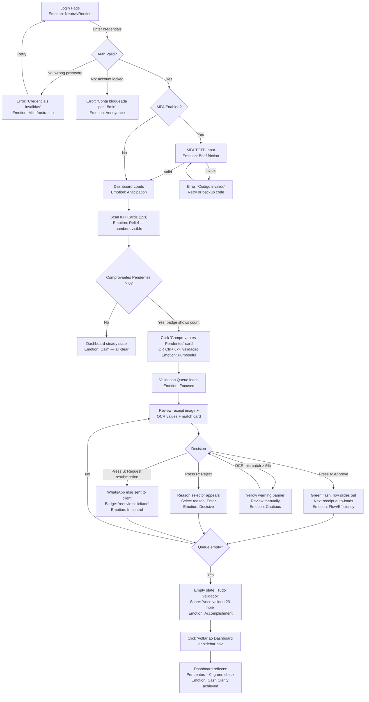
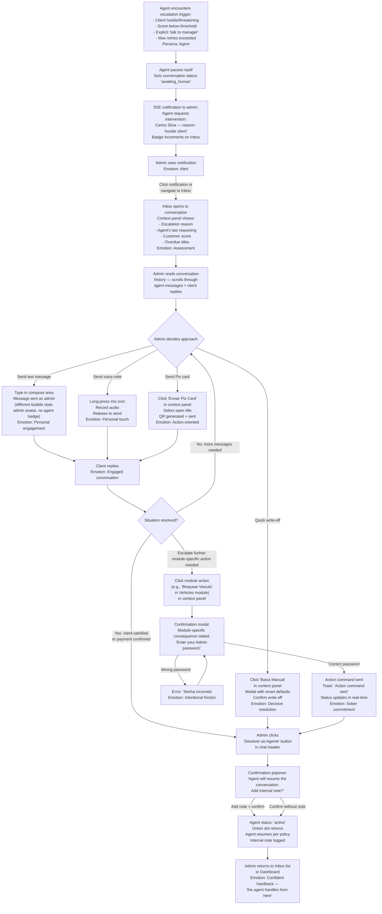

# UX Design Specification — {{product_name}}

**Author:** Pablo
**Date:** 2026-05-07

---

<!-- UX design content will be appended sequentially through collaborative workflow steps -->

## Executive Summary

### Project Vision

{{product_name}} is a generic recurring-billing, receivables, and collections platform with pluggable vertical asset modules. It replaces error-prone Excel-plus-WhatsApp workflows with a unified, reactive, "premium operational tool" experience. The platform covers four functional pillars under one roof: Asset Catalog & Patrimony, Receivables/Payables, Smart Collections (with AI agent), and Bank Reconciliation, topped by an executive dashboard. The first vertical module shipped is **Vehicles** (fleet rental to gig-economy drivers), but the architecture and UX accommodate any asset type — equipment, real estate, subscriptions, or services — through module-specific screens that load dynamically based on the active vertical. The UX bar is set by Linear, Notion, Stripe Dashboard and Vercel — clarity over cleverness, information density without claustrophobia, and zero learning curve for an Excel power user. Dark/light themes, glassmorphism-light surfaces, tabular numerics, keyboard-first interactions, and pixel-perfect drag-and-drop are first-class requirements, not polish at the end.

### Target Users

**Primary persona — Business Owner / Admin**
Mid-30s to 50s small-to-mid-business owner who rents, leases, or finances assets — or provides subscription-based services — to a pool of recurring clients. The first instance of this persona is a fleet operator renting cars to gig-economy drivers, but the same profile applies to equipment lessors, co-working space operators, or any asset-heavy subscription business. Spends 3-6 hours/day inside the system. Comes from Excel, with strong spreadsheet muscle memory: filters, inline edits, bulk select, copy/paste, keyboard shortcuts. Decides when to grant grace periods, when to escalate collections, and how aggressive the AI agent should be. Mostly desktop, but checks dashboards on tablet/phone in the field.

**Secondary — Operador (Employee)**
Performs day-to-day data entry. Cannot delete or change global parameters. Needs fast forms with strong validation. Often working in a noisy office or call.

**Secondary — Validador (Receipt Reviewer)**
Spends focused 30-60-minute blocks approving Pix receipts in a queue. Needs keyboard shortcuts, big visual previews, and minimal cognitive load between rows.

**Secondary — Auditor (Read-only)**
Compliance/oversight role. Needs searchable audit log with diffs and integrity indicators.

**External — Client (End Customer)**
Does NOT use the web app. Interacts only through WhatsApp via the AI agent. The single web touchpoint is the LGPD "My Data" self-service screen. In the Vehicles module this persona is a driver; in other modules it may be a tenant, subscriber, or lessee.

### Vertical Module UI Behavior

The platform UI adapts dynamically based on the active vertical module. Core screens (Dashboard, Receivables, Payables, Reconciliation, WhatsApp Inbox, Validation Queue, Reports, Settings) are always present. Module-specific screens appear in the sidebar and throughout the app only when the corresponding module is active:

| Module | Module-Specific Screens | Module-Specific Components |
|---|---|---|
| **Vehicles** | Fleet Map, Vehicle Detail (FIPE selector, tracker status), Vehicle ROI Dashboard | `<fleet-map>`, FIPE value card, tracker block/unblock action, vehicle-specific wizard steps |
| *(Future modules)* | *(e.g., Equipment Schedule, Property Inspections)* | *(Module-contributed components)* |

When no vertical module is active, the UI presents only the generic billing and collections surfaces. Each module registers its sidebar entries, wizard steps, and detail-page tabs via the module registry, so the UX scales without core changes.

### Key Design Challenges

1. **High information density without overwhelm.** Financial managers need lots of data on screen (filters, totals, status badges, KPIs) but the visual must read in fraction of a second. Solved by: tabular-nums, badge taxonomy, footer totals on every list, progressive disclosure (drawers/popovers).
2. **Excel mental model preserved.** Power-user shortcuts (`Ctrl+K`, `J/K`, `Enter`, `Esc`), inline editing, bulk selection with Shift-click, URL-state filters for bookmarking — all required day-one for the admin not to feel like they downgraded.
3. **Three distinct drag-and-drop semantics.** Schedule Builder (reorder installments), Reconciliation (drop transaction onto title, with multi-select 1:N and N:1), and Report Builder (pivot dimensions/measures). Each must feel native and never collide visually.
4. **7-state installment lifecycle must be readable at a glance.** `em_aberto`, `vencido`, `pago_aguardando_verificacao`, `pago`, `renegociado`, `cancelado` — color/badge taxonomy must be unambiguous and pass WCAG 4.5:1 contrast in both themes.
5. **Real-time everywhere without losing context.** WhatsApp inbox (WS), receipts arriving (SSE), dashboard KPIs (SSE), module-specific live data (SSE), validation queue updates. New events must surface visibly without jumping the user out of their current task.
6. **Trust as a UX dimension.** Financial mutations must feel auditable and reversible (where allowed). Paid installments must visually communicate immutability. Reverse-write-off needs intentional friction (Admin password + confirmation). Module-specific sensitive actions (e.g., remote vehicle block in Vehicles) need double approval.
7. **Mobile/tablet PWA without losing power features.** The admin uses tablet in the field — write-off, validation queue, and chat must all work one-handed at 768 px and be bookmarkable to home screen.
8. **Module-adaptive UI that feels native.** Module-specific screens and components must integrate seamlessly with the core design system so the user perceives one product, not a platform with bolt-on modules.

### Design Opportunities

1. **Pixel-perfect WhatsApp-style inbox inside the app.** Rare in billing/finance software — visceral wow factor for the admin demoing the product to peers. Three-pane layout with bubbles, ticks, customer-context sidebar with score, live "agente esta digitando..." indicator.
2. **Drag-and-drop reconciliation that feels like sorting cards.** Two panes with auto-suggested matches highlighted in green; one-click "Accept all suggestions"; multi-select N:1 / 1:N with visual chips while dragging.
3. **Command Palette (Ctrl+K) — Linear-style global nav.** Search any customer/asset/title; fire actions ("baixar titulo 1234"); jump to any screen. Becomes the admin's keyboard shortcut to everything.
4. **Visual installment builder.** Configurator on the left, live-rendering schedule table on the right, reorderable rows. Turns a complex financial contract into a tactile object.
5. **Score gauge as the customer's "vital sign".** A single gauge at the top of every customer touchpoint (ficha, chat sidebar, list rows) communicates health instantly and motivates the agent's policy decisions.
6. **Dark mode that's actually beautiful at night.** Many business owners run collections in the evening; a true dark theme with glassmorphism-light surfaces is a daily-use differentiator.
7. **Module-specific rich screens.** When the Vehicles module is active, the fleet map with smart clusters and status-coded markers gives an instant operational read. Future modules contribute their own high-value screens (e.g., equipment depreciation timeline, property inspection gallery).

## Core User Experience

### Defining Experience

The core experience is **supervisory, not operational**. The admin's day-one victory is that they no longer chase clients — the agent does. The product must therefore optimize for one tight loop, repeated multiple times per day:

> **Open the app -> glance at the operational pulse -> handle only what needs a human (validate, intervene, reconcile) -> close the app feeling in control.**

Three high-frequency touchpoints anchor this loop:

1. **Dashboard scan (15-60 s).** "What changed since I last looked?" — KPIs, pending receipts badge, urgent alerts, due-today count.
2. **Validation queue burst (30-60 s per receipt).** Approve / reject Pix receipts the agent already pre-categorized, with keyboard shortcuts.
3. **Reconciliation session (10-20 min, weekly or daily).** Drag-and-drop bank statement against system titles; auto-suggestions handle 80%, the admin only confirms.

Lower-frequency but emotionally critical moments:

- **WhatsApp inbox dive-in** — when the admin wants to "feel" how the agent is talking to a specific customer, or take over a sensitive conversation.
- **Contract creation wizard** — once per new client onboarding.
- **Asset ROI dashboard** — once or twice a month for buy/sell decisions (e.g., Vehicle ROI when the Vehicles module is active).

### Platform Strategy

**Primary: Web Responsive (desktop-first, tablet & mobile-ready).** Most operational time happens at a desktop with multiple monitors. The information density of the data tables, dashboards, and the 3-pane WhatsApp inbox demands >= 1280 px to be optimal.

**Secondary: PWA (installable on tablet & phone).** The admin and operador are sometimes in the field (visiting a client, inspecting an asset). Tablet (768-1024 px) and phone (375-428 px) must support: validation queue, write-off, chat reply, dashboard scan, and any module-specific field screens (e.g., fleet map when Vehicles is active). The PWA is installable from the browser and shows the brand logo on the home screen.

**Input modes:**
- **Mouse + keyboard primary** at desktop, with full keyboard navigation as a first-class citizen (`Ctrl+K` palette, `J/K` row nav, `Enter` open, `Esc` close, `A`/`R` for approve/reject in the validator queue).
- **Touch optional at desktop hardware** (touchscreens), required at tablet/phone. Drag targets >= 44 x 44 px on touch devices.

**No native app in MVP.** The PWA covers offline-shell and installability; a native shell can come later if push notifications are needed.

**Performance budget by platform:**
- Desktop 4G: FCP <= 1.2 s, TTI <= 2.5 s.
- Tablet 4G: same targets, with `@defer` for below-fold sections.
- Phone 3G: graceful degradation — skeleton-first, virtualized lists.

### Effortless Interactions

These flows must require zero conscious thought from the admin:

1. **Write-off a receivable.** From any context (list, customer detail, FAB), one click -> modal with smart defaults (today's date, updated value pre-filled, last-used method) -> confirm. Two taps total.
2. **Approve / reject a Pix receipt.** Validation queue lets the user blast through with `A`/`R` shortcuts; OCR pre-fills value/date so the user only eyeballs the image.
3. **Reconcile bank statement.** Drag-drop with auto-suggestions; "Accept all suggestions" handles the bulk; only divergences require attention.
4. **"Lancar e Pagar"** for an out-of-pocket expense. FAB -> compact modal -> confirm. Three fields, three seconds.
5. **Find anything.** `Ctrl+K` opens the command palette; type a customer name, asset identifier, or invoice number — Enter to jump. Replaces every "where do I find that screen" thought.
6. **Generate Pix QR for a customer over WhatsApp.** From the chat sidebar, one click on the open title -> "Send Pix Card" -> done. The card lands in the conversation as a native WhatsApp Pix card.
7. **Toggle theme.** Auto-follows OS by default; manual override is one click in the header. No setting required.
8. **Module-specific sensitive action (e.g., block a vehicle).** Map popup -> "Block" -> confirm with admin password. The admin never has to leave the map view, but the friction is intentional (this is a sensitive action). Each module defines its own high-friction actions.

### Critical Success Moments

These are the make-or-break inflections where the product earns trust or loses it:

1. **First receipt the agent processes end-to-end without intervention.** Client sends Pix proof in WhatsApp -> agent OCRs, performs primary write-off, replies politely, queues for human validation -> admin approves with `A` in 3 seconds. **The "hands-off collection works" moment.**
2. **First reconciliation that closes a month in 10 minutes instead of 2 hours.** Auto-match suggestions handle 50+ transactions; the admin confirms in batch. **The "I got my Sundays back" moment.**
3. **First time the contract wizard generates a polished PDF in seconds.** The Word/Excel cycle is gone. **The "this looks more professional than my bank's contracts" moment.**
4. **First asset ROI dashboard reveals an underperforming asset.** The admin sees in numbers what they suspected — and decides to sell or retire the asset. **The "this paid for itself" moment.**
5. **First successful intervention into an agent conversation.** The admin pauses the agent mid-conversation, sends a personal voice note, and resumes. **The "I'm still in control" moment — earns trust.**
6. **First catastrophic-feeling action that turns out reversible.** E.g., bulk-edit on installments shows a clean preview and an undo path. **The "I can experiment safely" moment.**
7. **First dark-mode session at 11 pm.** The admin checks tomorrow's collections from bed and the screen doesn't sear their eyes. **The "this app respects me" moment.**

### Experience Principles

These principles are the guardrails for every design decision in every story:

1. **Decisions in seconds, not minutes.** Every screen front-loads what matters (KPIs, totals, status badges); details live in drawers, popovers, modals. If a page takes more than a glance to read, it has too much above-the-fold.
2. **Keyboard-first, touch-friendly, mouse-fluent.** Power-user shortcuts are never optional. Touch targets are never < 44 x 44 px on tablet/phone. Mouse is the lowest-effort viable path on desktop, never the only one.
3. **Trust through transparency.** Every financial mutation shows what changed, who changed it, and the path to undo (when allowed). Paid installments visually telegraph their immutability with a lock icon and a muted treatment. Audit log is one click away from any action.
4. **The agent is a colleague, not a black box.** The agent's status (active / paused / typing / acting on a tool) is always visible. The admin can pause any conversation without friction and send their own message inline. Every agent decision is logged with a human-readable explanation.
5. **Real-time without surprise.** New events surface in dedicated channels — toasts for one-off notifications, badges for counters, status icons for states, soft "new!" pulses for items in lists. They never seize focus, never reorder rows under the user's mouse, never take over the screen.
6. **Density without anxiety.** Tabular numerics for every value. Neutral-cool base palette so semantic colors (success / warning / danger) read clearly. Generous spacing tokens around dense data. Never sacrifice contrast or hierarchy for compactness.
7. **Mobile is a first-class viewport.** Validation, write-off, chat reply, dashboard scan, and module-specific field screens work one-handed at 375 px. Field actions never require a desktop. The PWA is installable in two taps from the browser.
8. **Plug-and-play is visible to the admin, not just the developer.** The Integrations panel shows real status (healthy / degraded / offline), real "Test" buttons, and a one-click switch path between providers. Module-specific integrations (e.g., vehicle trackers in the Vehicles module) surface their status alongside core integrations. The architectural promise is operationally tangible.

## Desired Emotional Response

> **Note:** This is **Emotional Hypothesis v0** — derived from the PRD, the original briefing, and analogies to Linear / Notion / Stripe Dashboard. It is **not yet validated with a real operator**. Next step before locking the spec: 5 structured interviews with the target admin persona, plus citation of fintech B2B PME adoption research (Conta Azul, Omie, Asaas) where applicable. Treat the matrices below as falsifiable hypotheses, not findings.

### Primary Emotional Goals

**The hero emotion: Cash Clarity.**
The admin's actual job-to-be-done is not to feel calm — it is to **eliminate the doubt about their own cash**. *"When the month turns and I need to know who owes me, how much, and whether I can cover my own obligations — I want to stop mining spreadsheets and WhatsApp — so I can sleep without fearing that a client is cheating me and I'm not seeing it."* Cash Clarity is measurable, JTBD-anchored, and forces every design decision back to the question: *does this make the admin's cash position more visible, or more confusing?*

**Calm Command is the by-product**, not the hero. When the cash is clear, the admin naturally moves from reactive chaos to confident supervision.

**Reinforcing feelings beneath Cash Clarity:**

- **Relief** — the chase is over; the agent collects, OCR validates, reconciliation auto-suggests.
- **Pride** — the admin wants to demo the product to peers. Pride needs a **shareable artifact**: at month close, the dashboard exposes a discreet summary card the admin can screenshot and post in their WhatsApp groups.
- **Trust** — financial actions are auditable; paid installments visually telegraph immutability; the agent's reasoning is always nameable.
- **Sober Commitment** — for irreversible actions (reverse-write-off, module-specific sensitive actions, contract termination), the felt weight is *before* the click, through deliberate friction (typed confirmation, Admin re-auth), not through a fragile "undo" promise *after*.

### Hero Emotion Per Persona

A single banner emotion across personas is product arrogance. Each user operates in a different physical and cognitive context:

| Persona | Hero Emotion | Context | Visual Grammar Implication |
|---|---|---|---|
| **Admin (Business Owner)** | **Cash Clarity** | Desktop, multiple monitors, hours/day | Front-loaded cashflow, runway, score gauges |
| **Operador (Field)** | **Quick Certainty** | Mobile, 90 s windows, noisy environment | Big tap targets, 1-step confirms, offline-first |
| **Validador (Queue)** | **Effortless Verdict** | Desktop, focused 30-60 min bursts | `A`/`R` keyboard-first, big preview, no chrome |
| **Auditor (Read-only)** | **Procedural Certainty** | Desktop, sporadic deep dives | Trails, diffs, integrity badges, export-ready |
| **Client (External)** | **Settlement Reassurance** | WhatsApp only | Native Pix card, immediate confirmation message |

Each hero emotion drives different micro-decisions in stories that touch that persona's screens.

### Emotional Journey Mapping (Admin — Primary Path)

| Stage | What the user is doing | Desired feeling | Risk if we miss |
|---|---|---|---|
| **Discovery** (demo / pitch) | Watching a screen recording or peer demo | Curious + impressed | Skepticism — looks generic |
| **First login** (day 1) | Setup wizard, theme, first asset/client registration | Welcomed + capable | Overwhelm — too much to configure |
| **First data migration** | Importing legacy spreadsheets | Liberated + verifiable | Loss of control — distrust the import |
| **First write-off** | Manual baixa with comprovante upload | In control + efficient | Anxiety — wrong button fear |
| **First agent collection** | Reading a WhatsApp thread the agent ran | Surprised + reassured | Fear the agent will misbehave |
| **First reconciliation session** | Drag-drop OFX against titles | Flow + accomplishment | Frustration if auto-match wrong |
| **First mistake recovery** | Undo a bulk edit OR confirming an irreversible action | Forgiven *or* sober commitment | Panic — fearing data loss; OR false security from misleading undo |
| **Daily steady state** (week 4+) | 5-min dashboard scans | Calm + on top | Boredom or anxiety drift |
| **Steady State Under Pressure** | Operating during month-end chaos, BCB Pix instability, agent rate-limited | Supported + still in control | Helplessness; brittle system; rage-quit to Excel |
| **First peer demo** | Walking through the product with a peer | Proud + composed | Embarrassment if unfinished |

### Stakeholder Emotion Matrix

A second axis on the journey: emotion across **all** personas, not just admin. **Empty cells signal hypothesis gaps requiring validation.** Cells marked "---" are explicitly out of scope for that persona.

| Stage | Admin | Operador | Validador | Auditor | Client | Pablo-as-Operator |
|---|---|---|---|---|---|---|
| Discovery | Curious | --- | --- | --- | --- | Inventor's pride |
| First login | Welcomed | Onboarded fast | Onboarded fast | Granted access | --- | Founder's anxiety |
| Data migration | Liberated | --- | --- | Audit-ready | --- | High-stakes nervousness |
| First write-off | In control | Quick certainty | --- | Trail visible | Collection received | Validation panic |
| First agent collection | Surprised + reassured | --- | Verdict-ready | Reasoning logged | Settlement reassurance | Defensive monitoring |
| First reconciliation | Flow | --- | Effortless verdict | Audit reproducibility | --- | Hyperscrutiny |
| First mistake recovery | Forgiven *or* sober | Quick remedy | Anti-fatigue safety net | Tamper-evidence | Defensive paranoia? | Existential dread |
| Daily steady state | Calm | Daily ritual | Daily ritual | Quarterly drilldown | Routine | Settled supervision |
| Steady State Under Pressure | Supported | Even faster | Fatigue-aware | Crisis log | Sympathy or rage | All hands on deck |
| First peer demo | Proud | --- | --- | --- | --- | Vindicated |

### Anti-Journeys (must survive these to be robust)

The hero emotions only mean something if they hold under hostile scenarios. Three negative scenarios the system MUST be designed for:

1. **Client contests an agent-initiated collection.** Client prints the WhatsApp thread and threatens to complain publicly, claiming the agent billed wrong. **Admin's emotion:** reputational dread. **System commitment:** every agent message is reproducible from logs; conversation export is one-click; the agent's reasoning is auditable as if a human had typed it. The product gives the admin a defensible artifact in seconds.

2. **Admin week-1 still doesn't trust the agent.** First-week behavior pattern: the admin manually re-checks every collection in a parallel Excel. **Emotion:** active distrust. **System commitment:** "Agent dry-run mode" is a first-class feature — agent generates the message but the admin approves before send. Aggregate weekly summary shows agent decisions vs. admin overrides; trust is *earned over weeks*, not assumed at install.

3. **Validador at 11 pm commits a wrong reconciliation match.** Fatigue + identical-looking transactions + Pix screen-blur. **Emotion:** fear-of-error stronger than efficiency. **System commitment:** validation queue gracefully hard-stops at the configured time-window; sticky banner ("You've been validating for 47 minutes — consider a break"); critical matches (> R$ 500 or duplicate-suspect) require a 4-second delay before confirm. Anti-fatigue is structural, not motivational.

If Cash Clarity survives all three anti-journeys, it is robust. Otherwise, the honest hero emotion may be **Recoverable Confidence** — a confidence that *expects errors* and recovers cleanly.

### Micro-Emotions

Eight states, each paired with the contrast we must defeat:

- **Confidence > Confusion** — every screen tells the user where they are and what they can do (breadcrumb, page title, primary CTA).
- **Trust > Skepticism** — visible audit trails, integrity badges, masked PII, "tested at HH:MM" status on every integration.
- **Accomplishment > Frustration** — every successful mutation closes with a visible micro-confirmation; no "did it save?" doubt.
- **Forgiveness > Fear (where reversible)** — undo toasts, soft-delete with restore, preview-before-commit on bulk operations. **Only where the domain truly allows it.**
- **Sober Commitment > False Security (where irreversible)** — typed confirmation, Admin re-auth, modal language naming the consequence in plain Portuguese. The admin *feels* the weight before the click.
- **Flow > Distraction** — drag-and-drop, validation queue, command palette protect focus; new events pulse softly without seizing attention.
- **Belonging > Isolation** — fluent pt-BR, Brazilian formats (R$ tabular-nums, masked CPF, phone `(11) 9 9999-9999`), domain language (Pix, boleto). Module-specific terminology (e.g., FIPE, IPVA when Vehicles is active) loaded contextually.
- **Foresight > Surprise** — the admin must never be surprised by their own data. Surfaces: cash runway projection, predictive delinquency alerts (client score + payment pattern -> risk flag *before* default), rolling obligation calendar (module-specific recurring costs like IPVA/insurance when Vehicles is active, or lease renewals in other modules).
- **Quiet Reliability > Magic** (replacing "Delight"). Magic in a financial tool is one failure away from betrayal. The "Send Pix Card to WhatsApp" flow must be *predictable* — same outcome, same latency band, every time — not flashy. Reliability is the delight.

### Design Implications

How emotions translate into specific UX choices baked into the stories:

- **Cash Clarity -> "How much is left for me this month" is a first-class card.** Top-left of the dashboard, before any chart or list. Real-time, with drill-down to the assumptions that produced the number.
- **Cash Clarity -> Predictive delinquency surface.** Customer score + payment pattern produces a "risk of default in next 7 days" badge on the receivables list, *before* the title comes due. Foresight made tangible.
- **Cash Clarity -> Obligation calendar widget.** Module-specific recurring costs (IPVA, insurance, licensing when Vehicles is active; lease renewals, maintenance contracts in other modules) plus universal costs (salaries, rent) — every recurring cost the admin is responsible for — surfaces 30/15/3 days out as a single timeline.
- **Calm Command -> Layout breathing room** *only on the admin's heavy-data screens* (dashboard, customer detail, reports). Reconciliation trades polish for radical simplicity (drag-drop in 200 dense rows is carnival, not Linear).
- **Honest State (replaces "Predictable Real-Time").** Every screen displays a discreet "updated Xs ago" timestamp + a 4 px channel indicator: green = SSE live, amber = polling, gray = stale (> 30 s). Latency is dignified, not hidden.
- **Agent transparency via *named states*, not animations.** Three explicit visible states: *Receiving* (< 500 ms), *Reasoning -- Ns* (real counter visible after 2 s), *Waiting for external tool* (with name of the external system). When pgvector RAG is reindexing, banner: "Knowledge base updating -- responses may be 30 s delayed." Confidence comes from *naming* complexity, not hiding it.
- **Pride -> Shareable month-close summary.** A single screenshot-friendly card the admin can export to a WhatsApp group: "October closed -- R$ X received, Y% on-time, Z active clients." Pride needs an artifact.
- **Pride -> Polished microinteractions** *only where they amortize over many uses*: theme toggle, dashboard signal counters, sidebar collapse. NOT in reconciliation or validation queue (visual carnival risk).
- **Trust -> Visible installment state machine.** Consistent badge taxonomy with plain-Portuguese tooltip on every state.
- **Trust -> Lock + guard on paid installments.** Lock icon **and** the irreversibility is enforced at the modal layer (typing the installment number to reverse), not just visually decorated after the fact.
- **Sober Commitment -> Reversible/irreversible visual grammar split.** Reversible: undo toast, 30-second window, soft preview. Irreversible: modal with consequence stated in plain language, typed confirmation ("Type REVERSE to confirm"), Admin re-auth where applicable. Two distinct visual languages — never collapsed into a single "Forgiveness" pattern.
- **Quiet Reliability -> "Send Pix Card" flow under load test.** The microinteraction looks magical but the SLO is what earns trust: same visible behavior at p50 and p99 latencies; explicit "sent" / "awaiting delivery" / "failed -- resend" states.
- **Foresight -> Cash runway widget on dashboard.** Projected vs. realized revenue line for the next 30 days, given current open titles, score-weighted delinquency, and recurring expenses.
- **Density without anxiety -> Tabular numerics + neutral palette.** JetBrains Mono for money, right-aligned. Semantic color (success/warning/danger) only where it changes the admin's decision.
- **Per-persona viewport contracts.** The Operador's screens (mobile) optimize for **Quick Certainty**: 1-step confirms, large tap targets, offline-first quick write-off. The Validador's queue optimizes for **Effortless Verdict**: `A`/`R` shortcuts, edge-to-edge image, no chrome.

### Emotional Design Principles

The seven non-negotiables — the tiebreakers for any designer/developer:

1. **Reduce mental load before adding features.** White space, hierarchy, defaults over choices. If two options deliver the same outcome, pick the one that frees working memory.
2. **Earn trust transparently, never assume it.** Show the math, the actor, the timestamp. The product proves itself daily; it doesn't claim it.
3. **Distinguish the reversible from the irreversible with different visual grammars.** Undo toasts for reversible. Typed confirmation, Admin re-auth, plain-language consequence statement for irreversible. Never one pattern serving both.
4. **Surface the agent's reasoning through named states, never hide behind animations.** *Receiving / Reasoning -- Ns / Waiting for external tool.* Black-box AI breaks trust; glass-box AI builds it.
5. **Honest state beats predictable state.** Every screen tells the user how stale its data is and which channel delivered it. Latency dignified, not hidden.
6. **Cash stress is the basal state — design for it, not around it.** Runway, predictive delinquency, obligation calendar, "how much is left for me" must be first-class surfaces. The admin's primary anxiety is cash visibility, not workflow elegance.
7. **Reward returning users with steady-state polish.** First session wows; the 100th session must still feel fast and respectful. Performance, keyboard ergonomics, predictable behavior hold up over time.

## UX Pattern Analysis & Inspiration

### Inspiring Products Analysis

The {{product_name}} UX synthesizes patterns from products across **five distinct domains** that each solve a piece of our problem better than any single competitor in the billing/collections category does.

#### Information Density & Operational Dashboards

**Linear** (project tracking)
- *What it does well:* Highest signal-to-noise ratio of any operational tool in the consumer-facing SaaS space. Every pixel earns its place; nothing is decorative.
- *Patterns to study:* Command palette (`Cmd+K`) as the primary navigation surface; tabular nums in number columns; subtle row-hover states; keyboard-first navigation (`J/K/Enter/Esc`); URL state for filters; per-user view customization.
- *Why it transfers:* The admin's cognitive profile (Excel-trained, power-user, keyboard-fluent) maps almost 1:1 to Linear's target user.

**Stripe Dashboard** (financial operations)
- *What it does well:* Makes large quantities of financial data feel calm. Status pills with consistent color taxonomy. Right-aligned tabular numerics with subtle separators. Detail panels that slide from the right without losing list context. "Test mode" as a first-class environmental concept.
- *Patterns to study:* Status badge taxonomy (succeeded / pending / failed / refunded — 1:1 analog to our installment state machine); side-panel detail view with collapsible sections; fluid filter chips that combine with URL state; "Updated X seconds ago" honest-state indicators.
- *Why it transfers:* Stripe is the gold standard for B2B financial UX. Their badge taxonomy is essentially what we need for installments.

**Vercel Dashboard** (deploy/hosting ops)
- *What it does well:* Real-time activity feeds without being noisy. Soft pulse animations for new events. Clean separation of "global" vs "project" navigation.
- *Patterns to study:* Activity ribbon with live status pills; tab navigation inside detail views (Overview / Deployments / Logs / Domains parallels our Customer Detail tabs).

#### Knowledge & Long-Form Detail Pages

**Notion** (knowledge management)
- *What it does well:* Empty states that invite, not demand. Inline editing with no "save" button — autosave with visible confirmation. Content blocks that compose without modal hell.
- *Patterns to study:* Drawer-from-side for create/edit; inline cell editing with optimistic UI; soft empty-state illustrations with single primary CTA; tab persistence in URL.
- *Why it transfers:* The Customer Detail and Asset Detail pages need Notion's "browse and refine" feel — not a CRM's "fill out the form" feel.

#### Chat & Conversational UI

**WhatsApp Web** (literal reference)
- *What it does well:* The inbox visual language Brazilians already speak. Bubble geometry, tick semantics (sent/delivered/read), media handling, audio player, conversation list density.
- *Patterns to copy verbatim:* Bubble colors (`var(--whatsapp-out)` ~ Brazilian green-tint, white for incoming), tail shape, day separators with relative date pills, ticks animation timing.
- *Why it transfers:* The admin already speaks this visual language fluently. The product wins emotionally by matching it pixel-perfectly inside the app.

**Slack** (threaded power-user chat)
- *What it does well:* Three-pane layout (channels / messages / context). Deep keyboard navigation. Compose-area shortcuts.
- *Patterns to study:* Three-pane layout proportions; thread -> side panel pattern; `Cmd+K` for global search across messages.

**Perplexity / Claude / ChatGPT / Copilot Chat** (AI transparency)
- *What it does well:* Perplexity cites sources visibly under every answer. Claude/ChatGPT show named tool calls ("Searching the web...", "Running Python..."). GitHub Copilot Chat in VS Code shows the function name being invoked.
- *Patterns to study:* Named-state agent UI (Receiving / Reasoning -- Ns / Waiting for external tool). Source citation under agent decisions ("Tool: registrar_baixa_primaria -- installment=1234, value=R$ 350,00").
- *Why it transfers:* This is the literal instantiation of our "glass-box AI builds trust" principle. We are not inventing the pattern — we are bringing it from research-AI into financial-AI.

#### Drag-and-Drop & Reconciliation

**Trello / Linear board view** (drag mechanics)
- *What it does well:* CDK-quality drag affordances. Drop targets that glow on hover. Multi-select with shift+click. Optimistic UI on drop with rollback on error.
- *Patterns to study:* Drop-zone visual feedback (border + tint); drag handle affordance (a vertical-grip icon, not the whole row); auto-scroll when dragging near viewport edge.

**Asaas / Conta Azul / Omie** (Brazilian PME accounting reconciliation)
- *What they do partially well:* Have reconciliation flows that handle Pix and OFX in the Brazilian context. Recognize `R$` formats and Brazilian bank transaction descriptions.
- *What they do poorly:* Heavy form-based reconciliation, no drag-and-drop, spreadsheet-like density without hierarchy. We learn from their domain knowledge but reject their visual approach.

**QuickBooks Online (Match transactions UI)**
- *What it does well:* Side-by-side bank vs system view with "match" buttons. Auto-suggested matches highlighted.
- *What it does poorly:* Match suggestions are buttons, not drag interactions. Feels transactional, not tactile. We adopt the *layout* but reject the interaction model.

#### Maps & Spatial Operations (Vehicles Module)

**Onfleet / Bringg** (delivery dispatch)
- *What it does well:* Cluster markers; status-coded by vehicle; popup info cards; live updates via SSE-equivalent.
- *Patterns to study:* Marker iconography by vehicle state; cluster threshold by zoom level; sidebar filter by tag/status that updates the map live.
- *When it applies:* Only when the Vehicles module is active. Future modules may contribute their own spatial views.

**Uber Eats / iFood for Restaurants — operations panel**
- *What they do well:* Show real-time operational state with calm aggregation (orders in progress, average prep time) without screen-flashing.
- *Patterns to study:* "Calm operational tile" where numbers update smoothly without jarring re-renders.

#### Receipt / Approval Queues

**Expensify, Pleo, Ramp** (corporate expense receipt review)
- *What they do well:* Big image preview center-stage. Approve/Reject/Request Info as 1-key shortcuts. Automatic OCR pre-fill that the human only verifies. Sticky "X items remaining in queue" counter.
- *Patterns to copy nearly verbatim:* The validation queue layout (list left, big preview center, action panel right). The `A`/`R` keyboard shortcuts. The queue counter as a motivator.

#### Brazilian Premium Aesthetic

**Nubank** (app + dashboard) — proof that financial software in Brazil can feel premium. Lessons:
- Confident use of brand color (purple) without overpowering data.
- Tabular numerics for money, large hero-numbers for "saldo".
- Empty states that feel calm, not pushy.

**iFood for Restaurants** — proof that operational dashboards for Brazilian PME can be premium. Lessons:
- Real-time order ribbon with status pills.
- Per-channel revenue breakdown in glanceable cards.

### Transferable UX Patterns

Synthesizing across the inspiration sources, here are the **specific patterns to adopt or adapt** in {{product_name}}:

#### Navigation Patterns

- **Command Palette (`Ctrl+K`)** — adopt from Linear / Raycast / GitHub. Global search + action runner. Single most important power-user feature.
- **Three-pane layout for inbox** — adapt from Slack (channels / messages / context) using WhatsApp's visual language for the messages pane.
- **Sticky sidebar with collapsible sections** — adopt from Linear/Vercel. No hamburger fishing on desktop. Module-specific nav entries injected dynamically.
- **Tab-state-in-URL** — adopt from Notion/Stripe. Customer detail and asset detail tabs (`?tab=titulos`) survive refresh and are linkable.

#### Data Density Patterns

- **Status badge taxonomy** — adopt directly from Stripe Dashboard's pattern (consistent semantic colors, plain-language labels, tooltips on hover). Apply to our 7-state installment lifecycle.
- **Right-aligned tabular numerics with separators** — adopt from Stripe. JetBrains Mono for money columns; thin gray separator lines.
- **Footer totals on every list** — adopt from Stripe. "Selected: R$ X | Filter total: R$ Y | Delinquent: R$ Z".
- **Soft row-hover state** — adopt from Linear. Subtle background tint on hover, no jarring transitions.

#### Interaction Patterns

- **Drag-and-drop with glowing drop targets** — adapt from Linear board / Trello using `@angular/cdk/drag-drop`. Apply to: schedule builder, reconciliation, report builder.
- **Keyboard shortcuts for high-volume queues** — adopt directly from Expensify/Pleo (`A` approve, `R` reject, arrows navigate). Apply to: validation queue.
- **Inline cell editing** — adapt from Notion. Click to edit, blur to save, escape to cancel. Apply to: schedule builder, parameter tables in agent config.
- **Detail drawer from right** — adopt from Stripe / Notion. Apply to: customer create/edit, payable form, contract preview.
- **Auto-suggested matches with one-click bulk accept** — adapt from QuickBooks Match Transactions. Apply to: reconciliation auto-match.

#### Visual Patterns

- **WhatsApp bubble geometry** — copy verbatim. Apply to: in-app inbox.
- **Notion's empty states** — adopt the visual style (illustration + single primary CTA + secondary explanation). Apply to: every list and table.
- **Vercel's "updated X seconds ago" indicators** — adopt directly. Apply to: every screen with real-time data (dashboard, module-specific maps, inbox).
- **Stripe's filter chips with URL state** — adopt directly. Apply to: receivables list, payables list, audit log.
- **Score gauge** — adapt from GitHub repo-health rings or Spotify-style circular progress. Apply to: customer score card, hero element on customer pages.

#### Conversational AI Patterns

- **Named tool calls visible to user** — adopt from Claude/ChatGPT/Copilot Chat. Apply to: agent transparency chip ("Tool: registrar_baixa_primaria -- installment=1234").
- **Source citation under agent decisions** — adapt from Perplexity. Apply to: agent_runs detail view showing which titles, score, and policy clauses drove a decision.
- **Three explicit named states** — adopt from Copilot Chat (Indexing / Searching / Generating). Apply to: agent run states (Receiving / Reasoning -- Ns / Waiting for external tool).

#### Map Patterns (Vehicles Module)

- **Cluster markers + status-coded icons** — adopt from Onfleet/Bringg. Available only when Vehicles module is active.
- **Live SSE updates without map flicker** — adopt the technique of marker diff (only update positions that changed, not full re-render).

### Anti-Patterns to Avoid

Patterns observed in adjacent products that we will explicitly **not** import:

#### From Brazilian ERP / Accounting (TOTVS, SAP, some Conta Azul views)

- No **Spreadsheet-replicated grids** — endless rows of identical-weight cells with no hierarchy. We use density with hierarchy: bigger primary column, smaller secondary columns, badge-formatted status.
- No **Form rivers** — pages with 50+ fields under "Mais informacoes" toggles. We split into wizards or progressive disclosure inside drawers.
- No **Modal stacks** — modal opens a modal opens a modal. We use drawers and side panels that compose horizontally.

#### From Generic Banking Apps

- No **Hidden state on transactions** — some banking apps don't visually distinguish "pending" from "cleared" until you tap into detail. We surface state on the row itself.
- No **Cryptic numeric codes** — "Status 47B" or similar. We use plain-Portuguese labels with tooltip explanations.

#### From CRM/Sales Tools (Salesforce, HubSpot)

- No **Customizable everything** — overwhelming customization options at first install. We ship strong opinionated defaults; customization comes later.
- No **"Engagement-driving" notifications** — gamified counters, streaks, badges designed to addict. We respect the user's attention.

#### From AI Chatbots (most consumer LLM UIs)

- No **Black-box reasoning** — "The AI did this because... well, it's AI." We always surface the named tool calls, the customer score that drove the decision, and the policy clause that authorized it.
- No **Animated "thinking" spinners with no progress** — the user has no idea if it's 1 s or 30 s away. We show real elapsed counters after 2 s.
- No **Magic outcomes** — "Look! It just worked!" Magic in fintech is one failure away from betrayal. We emphasize predictability over surprise.

#### From Mobile-Last Desktop-First Apps

- No **Tap targets < 44 px on mobile** — desktop layouts squeezed into mobile without rethinking density.
- No **Hover-only interactions** — features that only reveal on `:hover`, inaccessible on touch.
- No **Mobile menu burying everything in a hamburger** — primary actions need to live where the thumb already is.

#### Domain-Specific Anti-Patterns (Billing & Collections)

- No **Aggressive collection messaging templates that read like threats** — damages relationships with clients, increases churn. The agent's tone is parameterized but defaults are firm-but-respectful.
- No **One-click destructive module actions** (e.g., vehicle block in the Vehicles module) — we deliberately add friction (Admin password, double confirmation) because the consequence (client loses access to the asset) is severe.
- No **Score gauges that gamify client punishment** — the score is internal intelligence, not a social-credit display the client sees.

### Design Inspiration Strategy

The strategy that synthesizes **what to adopt directly, what to adapt, and what to avoid**:

#### Adopt Directly (proven, fits exactly)

1. **Stripe Dashboard's status badge taxonomy** for installment lifecycle.
2. **Linear's `Ctrl+K` command palette** for global navigation.
3. **WhatsApp Web's chat visual language** for the in-app inbox.
4. **Expensify's `A`/`R` queue keyboard shortcuts** for validation.
5. **Claude/Copilot Chat's named tool-call surfacing** for agent transparency.
6. **Notion's drawer-from-right pattern** for create/edit forms.
7. **Onfleet's cluster + status-coded markers** for module-specific maps (e.g., fleet map in Vehicles module).

#### Adapt (good idea, needs modification)

1. **QuickBooks's match-transactions layout** -> bring the side-by-side, drop the click-buttons, replace with CDK drag-and-drop.
2. **Stripe's right-side detail panel** -> use for customer/asset detail but integrate full tabbed sub-navigation (deeper than Stripe's typical drawer).
3. **Asaas/Conta Azul's domain knowledge of Brazilian banks** -> take the parsing intelligence (BR Code formats, bank descriptions) but reject their spreadsheet-density UI.
4. **GitHub repo-health ring** -> transform into the customer score gauge with an animated arc that telegraphs trustworthiness.
5. **Perplexity's source citations** -> adapt for agent_runs ("This decision was based on customer score 67, policy threshold 50, current overdue days 5").

#### Avoid (explicitly off-limits)

1. **Salesforce-style customization labyrinth** at install — we ship opinionated defaults.
2. **Black-box AI reasoning** — every agent decision must be auditable in plain Portuguese.
3. **TOTVS-style flat-grid density** — we use hierarchical density.
4. **Mobile-last desktop-first layouts** — mobile is a first-class viewport.
5. **Aggressive collection-template defaults** — the agent's default tone is firm-but-respectful.
6. **One-click destructive actions** — irreversible operations require intentional friction.
7. **Magic-AI patterns** — predictability beats surprise in financial software.

#### Strategic Tension to Watch

The biggest design risk identified is the tension between **"Linear-grade premium polish"** (an aspiration) and **"cognitive simplicity for an Excel-trained user"** (a requirement). The resolution:

- **Polish goes where it amortizes**: dashboard, customer detail, agent inbox, contract PDF, theme transitions.
- **Radical simplicity goes where stakes are highest**: reconciliation, validation queue, write-off modal, irreversible-action confirmations.

Each story will note which mode it operates in.

## Design System Foundation

### 1.1 Design System Choice

**{{product_name}} adopts a *custom-built Tailwind v4 + shadcn-inspired token system*** implemented as native Angular 21 standalone components — neither a "build from scratch" nor an "import a packaged UI library" approach, but an intentional middle path.

**Concretely:**

- **Styling primitive**: Tailwind CSS v4 utility classes only — never inline styles, never component-scoped CSS for visual styling (component CSS files stay essentially empty, as enforced by the frontend manifesto).
- **Design tokens**: A complete set of CSS variables (`--surface`, `--surface-elevated`, `--text-primary`, `--accent`, `--success`, `--warning`, `--danger`, `--whatsapp-out`, `--shadow-sm`, etc.) declared in `styles.css` inside an `@theme {}` block. Light theme is default; dark theme overrides variables under `[data-theme="dark"]`.
- **Component primitives**: Custom-built Angular standalone components in `frontend/src/app/shared/components/` — `<ui-button>`, `<ui-input-text>`, `<ui-input-money>`, `<ui-select>`, `<ui-modal>`, `<ui-drawer>`, `<ui-data-table>`, `<ui-toast>`, `<ui-skeleton>`, `<ui-badge>`, `<ui-empty-state>`, `<ui-score-gauge>`, `<ui-icon>`, etc. Each consumes the CSS variables; brand changes are a single-file edit.
- **Iconography**: Heroicons exclusively, via `@ng-icons/core` + `@ng-icons/heroicons`. Reusable `<ui-icon name="HeroXMark" />` wrapper. No inline SVGs, no other icon families.
- **Typography**: **Inter** as the primary UI typeface; **JetBrains Mono** for monetary and code-like numerics (any column with `R$` values, asset identifiers, CPF, audit log entries). Both self-hosted in `frontend/public/fonts/`.
- **Color palette**: Cool-neutral base (zinc/slate range) with a single semantic accent color. The accent decision is deferred to the Visual Foundation step; placeholder candidates: indigo `#6366F1` (modern, trust-aligned) or verde-financeiro `#10B981` (sector-aligned with money).
- **Theme support**: Light + Dark, with system-default detection on first load and manual override persisted via `theme.service.ts` to localStorage. Both themes meet WCAG 2.1 AA contrast (>= 4.5:1 for body text, >= 3:1 for large text and UI components).
- **NOT used**: Material Design, Ant Design, PrimeNG, Bootstrap, MUI, Chakra UI, native shadcn/ui CLI, or any pre-packaged Angular UI library that would impose a non-shadcn aesthetic or React-only patterns.

### Rationale for Selection

The choice is the resolution of seven competing forces:

1. **Aesthetic ambition (Linear / Stripe / Notion grade)** rules out generic component libraries (Material, Ant). Their visual identity is too recognizable and would betray our "premium operational tool" promise the moment a user has seen any other Material app.
2. **Speed of delivery** rules out a fully custom system. The MVP must ship in <= 12 weeks; we cannot afford a 4-week design-token + primitive-component side-project before story 1.1.
3. **Brand sovereignty** rules out copying shadcn/ui's React components verbatim — we are on Angular, and we want a single source of truth (our own primitives) rather than two systems.
4. **Frontend manifesto compliance** is non-negotiable: standalone components, signals-first, Tailwind utilities only, three-file components with empty CSS. Any third-party library that violates these rules is disqualified.
5. **Plug-and-play philosophy** extends to the design system: changing accent color, switching the entire theme, swapping the icon family, or rebranding should be a one-token-file edit, not a component-by-component change.
6. **Performance budget** (FCP <= 1.2 s on 4G) rules out heavy component bundles. Tailwind v4's JIT compilation and tree-shaking guarantee we ship only the utilities actually used.
7. **Accessibility floor (WCAG 2.1 AA)** means whatever components we build need ARIA done right, focus management correct, contrast verified, reduced-motion respected. Building primitives ourselves lets us own that quality.

### Implementation Approach

**Story 1.2 (Bootstrap the Angular 21 Frontend) is where the design system foundation lives.** The acceptance criteria already pin:

- Tailwind v4 installed with minimal config + typography + forms plugins.
- `styles.css` containing the full `@theme` token block for both themes.
- `theme.service.ts` with the `theme()` signal and `setTheme()` API.
- `<ui-icon>` wrapper component as the first shared primitive.
- `AppShellComponent` as the layout container that uses the tokens.

Subsequent stories build on this by adding shared primitives **as needed** (don't pre-build the whole catalog — each new feature adds the primitives it requires, with strong bias to reuse).

**Component build-order priority** (used by sprint planning):

1. **Core layout**: `AppShellComponent`, `<ui-icon>`, `<ui-button>`, `<ui-toast>` (Story 1.2).
2. **Forms primitives**: `<ui-input-text>`, `<ui-input-money>`, `<ui-input-cpf>`, `<ui-select>` (Stories 1.5, 2.3).
3. **Data primitives**: `<ui-data-table>`, `<ui-badge>`, `<ui-skeleton>`, `<ui-empty-state>` (Story 2.2).
4. **Composition primitives**: `<ui-modal>`, `<ui-drawer>`, `<ui-tabs>`, `<ui-stepper>` (Stories 2.3, 2.4, 2.7).
5. **Specialized primitives**: `<ui-score-gauge>`, `<ui-leaflet-map>`, `<ui-chart-card>`, `<ui-pdf-viewer>`, `<ui-drag-list>`, `<ui-command-palette>` (added in their respective epic stories).

### Customization Strategy

**Single-file rebranding.** Changing the entire visual identity of {{product_name}} (for white-label or future SaaS multi-tenancy) is constrained to:

1. `frontend/src/styles.css` — edit the `@theme` block (light + dark CSS variables).
2. `frontend/public/images/logo.svg` + `logo-dark.svg` — replace the logo files.
3. `frontend/public/icons/` — swap PWA icons.
4. `frontend/public/fonts/` — optionally swap the typeface files.

No component code needs to change. This is the operationalization of plug-and-play at the visual layer.

**Per-feature visual modes.** Resolving the tension surfaced in the Inspiration Strategy, two modes coexist within the same design system:

- **Polish mode** — applied on dashboard, customer detail, asset ROI, contract PDF, theme transitions. Uses gradient surfaces, glassmorphism, animated counters, FLIP transitions.
- **Simplicity mode** — applied on reconciliation, validation queue, write-off modal, irreversible-action confirmations. Uses flat surfaces, minimal motion, maximum contrast, plain typography.

Both modes share the *same* tokens and primitives — they differ only in *which* utilities they compose.

**Token override at component scope.** When a component needs a non-standard color (e.g., the WhatsApp inbox bubbles use `--whatsapp-out` and `--whatsapp-in` tokens), the token is added to the global `@theme` block — never as a magic number inside the component. Single source of truth is sacred.

**Design system documentation.** A future Storybook instance will catalog every primitive with light/dark variants, prop tables, and accessibility notes. The Storybook is a Story 9.7 deliverable (UX Polish epic).

## 2. Core User Experience

### 2.1 Defining Experience

**"The agent collected and I just watched."**

Every successful product has a defining interaction — the one users describe to friends:

- Tinder: "Swipe to match with people"
- Spotify: "Discover and play any song instantly"
- **{{product_name}}: "Open the app, see the agent already collected, confirm with one keystroke"**

The admin's daily hero moment is this 30-second loop:

1. Open inbox -> see a conversation badge "Agent: collected" in green.
2. Tap into the thread -> read the agent's polite messages, the Pix card sent, the receipt received, the primary write-off logged automatically.
3. Glance at validation queue -> receipt already pre-filled by OCR.
4. Press `A` -> approved. Next.

This is the moment the admin screenshots and sends to their WhatsApp group of peers. It is the single interaction that justifies the product's existence and earns the subscription.

**If we nail this loop, everything else follows.** Dashboard metrics update because titles were written off. Reconciliation gets easier because receipts are already validated. Score is meaningful because payment history is real-time. ROI dashboards are accurate because the financial pipeline is clean.

### 2.2 User Mental Model

**How the admin currently solves this problem:**
The admin opens WhatsApp, scrolls through 30+ conversations, finds who's overdue, types a polite (or not) message, waits for a Pix screenshot, opens their bank app to verify, opens Excel to mark as paid, moves to the next. Repeat 20-30 times per day. Total: 2-3 hours of fragmented, anxiety-laden work spread across the day.

**Mental model they bring:**
- WhatsApp is the communication layer — they already "think in WhatsApp."
- Excel is the source of truth — they trust rows and columns.
- The bank app is the final arbiter — "did the money actually arrive?"
- Collecting is personal and emotional — "I can't be too harsh or the client quits; I can't be too soft or they take advantage."

**What they love about existing approach:**
- WhatsApp is instant, familiar, flexible.
- Excel lets them see everything at once (all clients, all payments).

**What they hate:**
- Repetition of the same message 30 times a day.
- Cross-referencing WhatsApp screenshot -> bank statement -> Excel row manually.
- No audit trail — "did I already message Paulo about Tuesday's payment?"
- No escalation policy — "when do I threaten vs. give grace?"
- No way to prove to themselves that every payment is accounted for.

**Key insight:** The admin's mental model is *conversational-financial*. They think about clients as *conversations* (not as *database records*), and about payments as *events in a chat thread* (not as *rows in a ledger*). {{product_name}} must honor this mental model: the inbox IS the financial operating surface, not a separate module.

### 2.3 Success Criteria

The defining experience succeeds when:

| Criterion | Measurable Proxy |
|---|---|
| **"This just works"** | Time from receipt arrival to admin confirmation < 60 s (excluding admin idle time) |
| **"I feel smart"** | Admin completes validation burst of 10 receipts in < 5 minutes using only keyboard |
| **"The agent is good"** | < 5% of agent-run collections require admin intervention after 30-day calibration |
| **"I trust the numbers"** | 0 discrepancies found in monthly reconciliation not already flagged by auto-match divergence panel |
| **"It's fast"** | Inbox loads in < 1.5 s; new messages appear in < 2 s via WebSocket; validation queue renders receipt image in < 800 ms |
| **"I can always intervene"** | Admin can pause the agent and type a message within 3 s from any screen via sidebar toggle |

### 2.4 Novel UX Patterns

{{product_name}}'s defining experience **combines familiar patterns in innovative ways** rather than inventing entirely new ones:

**Familiar patterns reused as-is:**
- WhatsApp chat bubbles, ticks, media handling — zero learning curve.
- Approve/Reject keyboard queue — proven in Expensify/Ramp.
- Dashboard KPI cards — proven in Stripe/Vercel.
- Drag-and-drop lists — proven in Trello/Linear.

**Familiar patterns combined innovatively:**
- **Chat inbox AS the financial operating surface.** In most fintech apps, the chat is a support channel, separate from finance. In {{product_name}}, the chat thread IS where the admin sees payments happen. The right-side context panel (titles, score, quick actions) fuses the conversation with the financial record. This is the product's unique twist: *every WhatsApp conversation is also a mini financial dashboard for that client.*
- **AI agent with visible tool calls inside a chat UI.** Most AI chatbots hide their reasoning. {{product_name}} shows "Tool: registrar_baixa_primaria -- installment #1234, R$ 350,00" as a system message in the thread. The admin reads the agent's actions like they'd read a colleague's notes.
- **Validation queue triggered by a chat event.** The receipt arrives in WhatsApp -> OCR runs -> the queue updates -> the admin approves -> the chat thread shows the confirmation. The queue and the inbox are not separate workflows — they're the same event observed from two angles.

**Novel patterns (requires teaching):**
- **Score-based agent behavior that the admin can inspect.** The admin sees "Agent sent grace extension (3 days) because score=82, policy threshold=80." This transparency pattern is borrowed from Perplexity's source citations — but applied to financial decisions. Users need a 30-second onboarding tooltip the first time they see it: "The agent explains every decision here."

### 2.5 Experience Mechanics

The step-by-step mechanics of the defining interaction — "Agent collected and I just watched":

**1. Initiation — what brings the admin to the loop:**

- **Push trigger:** SSE notification badge updates on the sidebar: "3 new validations" or "Agent: 2 collections completed." A soft pulse animation on the inbox icon. No sound by default; optional.
- **Pull trigger:** Admin opens the app as part of their morning routine -> dashboard's "Pending Receipts" card shows the count with urgency badge if > 5.
- **Keyboard shortcut:** `Ctrl+K` -> type "validacao" -> Enter -> lands on validation queue.

**2. Interaction — what the admin actually does:**

- **In the validation queue:** left pane shows the pending list (receipt thumbnail + customer name + amount + time received). Center pane shows the full-size receipt image with zoom. Right pane shows the installment match (title number, expected amount, OCR-extracted amount, delta if any, customer score).
- **Approve:** press `A`. The row slides out with a green flash. The next receipt auto-loads. Zero mouse required.
- **Reject:** press `R`. A reason-selector appears (valor divergente / ilegivel / suspeita de fraude / outro + free text). Tab to reason, Enter to confirm.
- **Request resubmission:** press `S`. Fires a WhatsApp message to the client asking for a new receipt. Stays in queue with "resubmission requested" badge.
- **Skip:** arrow down. Moves to next without acting.

**3. Feedback — what tells the admin it's working:**

- **Immediate:** green/red flash on the row. Badge count decrements. Toast: "Installment #1234 approved -- awaiting reconciliation."
- **Cumulative:** top KPI "Validated today: 12 | Rejected: 1 | Pending: 3" updates live.
- **Trust-building:** every approved receipt moves the installment to `pago_aguardando_verificacao` — the state change is visible in the customer's title list immediately.

**4. Completion — how the admin knows they're done:**

- **Queue empty state:** illustration + "All validated! Next round when a new receipt arrives." + badge count shows 0.
- **Dashboard reflects:** "Pending Receipts" card shows 0 with a green checkmark.
- **Implicit continuation:** when the admin finishes validation, they're naturally 1 click away from the inbox (to read agent conversations) or the dashboard (to check overall cash position). The loop feeds forward.

**5. Error recovery — what happens when things go wrong:**

- **OCR mismatch:** if OCR-extracted value differs from expected by > 5%, the row shows a yellow warning badge with both values side-by-side. The admin reviews visually and decides.
- **Ambiguous match:** if the agent couldn't determine which installment the receipt belongs to, the right pane shows 2-3 candidates ranked by likelihood. The admin clicks the right one.
- **Accidental approve:** a 10-second undo toast appears. After that, the next stage (reconciliation) is the safety net.
- **Accidental reject:** the receipt re-enters the queue with a "rejected by {user} -- revert?" link. One click undoes.

## 9. Design Directions — Chosen Direction & Textual Wireframes

Since the visual direction is locked (shadcn-inspired tokens, Tailwind v4, indigo `#6366F1` accent, Inter + JetBrains Mono, Heroicons, light/dark themes), this section documents the chosen direction through detailed textual wireframes of the five most critical screens. Each wireframe describes layout grid, component placement, state variations, and responsive adaptation.

### 9.1 Dashboard Principal

**Purpose:** The admin's landing page. Answers "what changed since I last looked?" in under 15 seconds. Front-loads Cash Clarity via KPI cards, charts, and the runway widget.

**Layout Grid (desktop >= 1280px):**

```
+-------------------------------------------------------------+
| HEADER: logo | breadcrumb: "Dashboard" | search (Ctrl+K) | theme toggle | avatar menu |
+-------------------------------------------------------------+
| SIDEBAR (240px, collapsible to 64px icon-only)              |
|   - Dashboard (active, indigo bg)                           |
|   - Clientes                                                |
|   - Ativos (module-adaptive label)                          |
|   - Contratos                                               |
|   - A Receber (badge: 3 vencidos)                           |
|   - A Pagar                                                 |
|   - Inbox WhatsApp (badge: 5 novas)                         |
|   - Validacao (badge: 7 pendentes)                          |
|   - Conciliacao                                             |
|   - Relatorios                                              |
|   - [Module-specific entries, e.g., "Mapa da Frota"         |
|     when Vehicles module is active]                         |
|   - Integracoes                                             |
|   - Configuracoes                                           |
|   ----                                                       |
|   - Collapse toggle (<<)                                    |
|   - "Atualizado ha 3s" honest-state indicator               |
+------+------------------------------------------------------+
| MAIN CONTENT (fluid, min 800px)                             |
|                                                              |
| ROW 1: Page header                                          |
|   "Dashboard" (h1) | date range selector | "Bom dia, Pablo" |
|                                                              |
| ROW 2: KPI Cards (4-col grid, gap-4)                        |
|   [Receita Mensal]  [Despesa Mensal]  [Lucro Liquido]  [Inadimplencia %] |
|   Each card: icon top-left, label, hero number (JetBrains   |
|   Mono, 2xl), trend arrow + % vs previous period,           |
|   sparkline (last 6 periods), click to drill-down           |
|                                                              |
| ROW 3: Secondary KPI row (4-col grid)                       |
|   [Asset Portfolio Value]  [Comprov. Pendentes]  [Score Medio]  [Cobrancas Hoje] |
|   "Comprov. Pendentes" card: amber if > 5, red if > 10     |
|   Click navigates to validation queue                        |
|   Note: "Asset Portfolio Value" adapts per module            |
|   (e.g., "Frota (R$ FIPE)" when Vehicles is active)         |
|                                                              |
| ROW 4: Two-column layout (8-col + 4-col)                   |
|   LEFT (8-col): Cash Runway Chart Card                      |
|     - Title: "Quanto Sobra Pra Mim Este Mes"               |
|     - Area chart: projected (dashed) vs realized (solid)    |
|     - X-axis: days of month, Y-axis: R$ cumulative          |
|     - Hover tooltip: date, projected, realized, delta        |
|     - Footer: "Projecao baseada em X titulos abertos,       |
|       score medio Y, despesas recorrentes Z"                 |
|   RIGHT (4-col): Obligations Timeline Widget                |
|     - Vertical timeline: next 30 days                       |
|     - Items: module-specific obligations (e.g., IPVA,       |
|       licenciamento, seguro when Vehicles active) +          |
|       universal obligations (salarios, aluguel)              |
|     - Each item: icon, name, asset ID (if applicable),      |
|       date, R$ value, urgency badge (red < 3d, amber < 15d)|
|                                                              |
| ROW 5: Two-column layout (6-col + 6-col)                   |
|   LEFT: Receivables by Status (donut chart)                 |
|     - Segments: em_aberto, vencido, pago_aguardando_verificacao,   |
|       pago_aguardando_verificacao, pago, renegociado,       |
|       cancelado — using installment badge colors             |
|     - Center: total count + total R$                         |
|   RIGHT: Recent Activity Feed                                |
|     - Timeline list of last 15 events                       |
|     - Each: icon, description, actor, timestamp             |
|     - Types: write-off, agent collection, validation,       |
|       new contract, module-specific events (e.g., vehicle   |
|       status change)                                         |
|     - "Ver todas" link to audit log                          |
|                                                              |
| ROW 6: Quick Actions Bar (sticky bottom, optional)          |
|   [+ Baixa Rapida]  [+ Lancar Despesa]  [Abrir Inbox]      |
+--------------------------------------------------------------+
```

**State Variations:**

- **Loading:** Each KPI card shows a skeleton pulse matching its final layout (number placeholder, sparkline placeholder). Charts render skeleton rectangles. Activity feed shows 5 skeleton rows. No full-page spinner ever.
- **Empty (first login, no data):** KPI cards show "R$ 0,00" with a friendly "Configure seu primeiro contrato" CTA. Charts show empty-state illustration with "Dados aparecerao aqui quando houver movimentacao." Obligations timeline shows "Nenhuma obrigacao cadastrada."
- **Populated:** As described in the wireframe above.
- **Error (API failure):** Affected card shows a red outline with "Erro ao carregar — tentar novamente" link. Other cards continue displaying cached data with amber honest-state indicator "dados de Xmin atras."
- **Stale data (SSE disconnected):** Honest-state indicator in sidebar turns amber; a thin amber banner appears below the header: "Conexao em tempo real perdida — dados podem estar desatualizados. Reconectando..."

**Responsive Adaptation — 768px (tablet portrait):**
- Sidebar collapses to icon-only (64px) by default; swipe-right to expand as overlay.
- KPI cards reflow to 2-col grid (2 rows of 2).
- Cash Runway and Obligations Timeline stack vertically (full width each).
- Donut chart and Activity Feed stack vertically.
- Quick Actions Bar becomes a floating FAB (bottom-right) with expandable speed-dial.

**Responsive Adaptation — 375px (phone):**
- Sidebar hidden; hamburger icon in header opens full-screen overlay nav.
- KPI cards reflow to 1-col (stacked, swipeable horizontal carousel as alternative).
- Cash Runway chart fills full width; obligations timeline becomes a collapsible accordion.
- Donut chart and Activity Feed each full-width, stacked.
- FAB with single primary action ("Baixa Rapida"); long-press for speed-dial.
- Page header simplifies: "Dashboard" only, date range moves to a filter button.

### 9.2 WhatsApp Inbox

**Purpose:** The conversational-financial operating surface. The admin monitors agent activity, intervenes when needed, and manages client relationships. Must feel like WhatsApp but with financial superpowers.

**Layout Grid (desktop >= 1280px):**

```
+-------------------------------------------------------------+
| HEADER (shared app header)                                   |
+------+------------------------------------------------------+
| SIDE  | INBOX CONTENT (3-pane layout, fills remaining width) |
| BAR   +------------------+-------------------+--------------+
|       | PANE 1: Convers.  | PANE 2: Chat      | PANE 3: Ctx  |
|       | List (280px)      | Thread (flex-1)    | Panel (320px)|
|       |                   |                    |              |
|       | [Search bar]      | [Chat header]      | [Customer    |
|       | [Filter chips:    |  Avatar, Name,     |  card: photo,|
|       |  Todos | Agente   |  Phone, Agent      |  name, CPF,  |
|       |  | Humano |       |  status chip       |  score gauge |
|       |  Pendente]        |  (active/paused/   |  (arc 0-100),|
|       |                   |  typing), "Pausar  |  phone, since|
|       | [Conversation     |  Agente" toggle    |  date]       |
|       |  rows:]           |                    |              |
|       |  - Avatar         | [Message area      | [Titulos     |
|       |  - Name           |  (scrollable)]     |  Abertos:    |
|       |  - Last msg       |  - Day separator   |  mini table  |
|       |    preview        |    ("Hoje",        |  with status |
|       |  - Timestamp      |    "Ontem", date)  |  badges,     |
|       |  - Unread badge   |  - Bubbles:        |  values,     |
|       |  - Agent status   |    outgoing (indigo |  due dates.  |
|       |    indicator      |    /whatsapp-out),  |  Click row   |
|       |  - Score mini     |    incoming (white/ |  -> "Enviar  |
|       |    badge (color)  |    surface-elevated)|  Pix Card"   |
|       |                   |  - Ticks (sent/    |  action]     |
|       | [Sorted by:       |    delivered/read)  |              |
|       |  most recent,     |  - Media: images   | [Historico   |
|       |  unread first]    |    (thumbnail +    |  Pagamentos: |
|       |                   |    lightbox),      |  sparkline   |
|       |                   |    audio (inline   |  last 6mo]   |
|       |                   |    player), PDF    |              |
|       |                   |  - System msgs:    | [Agent Runs: |
|       |                   |    tool calls in   |  last 3 with |
|       |                   |    gray chip       |  expand to   |
|       |                   |    ("Tool: baixa   |  see full    |
|       |                   |    primaria -      |  reasoning]  |
|       |                   |    #1234, R$350")  |              |
|       |                   |  - Agent reasoning | [Quick       |
|       |                   |    expandable      |  Actions:]   |
|       |                   |                    |  - Enviar    |
|       |                   | [Compose area]     |    Pix Card  |
|       |                   |  - Text input      |  - Baixa     |
|       |                   |  - Attach (image,  |    Manual    |
|       |                   |    PDF, audio)     |  - Ver Ficha |
|       |                   |  - Send button     |  - [Module-  |
|       |                   |  - "Agente esta    |    specific  |
|       |                   |    digitando..."   |    actions,  |
|       |                   |    indicator       |    e.g.,     |
|       |                   |                    |    Bloquear  |
|       |                   |                    |    Veiculo]  |
|       |                   |                    |  - Exportar  |
|       |                   |                    |    Conversa  |
+-------+------------------+-------------------+--------------+
```

**State Variations:**

- **Loading:** Conversation list shows 8 skeleton rows (avatar circle + 2 text lines). Chat area shows skeleton bubbles. Context panel shows skeleton card.
- **Empty (no conversations):** Illustration of a phone with chat bubbles + "Nenhuma conversa ainda. O agente iniciara as cobrancas conforme a politica configurada." + CTA "Configurar Agente."
- **Populated:** As described above.
- **Agent active:** Green dot on conversation row; agent-status chip in chat header shows "Agente ativo" in green. Compose area shows "Agente responde automaticamente" label; admin can still type (this pauses the agent).
- **Agent paused (human takeover):** Amber dot on conversation row; chip shows "Voce assumiu" in amber. Compose area is primary — admin types freely. "Devolver ao Agente" button appears.
- **Agent typing:** Animated "..." bubble at bottom of chat thread, with "Agente esta digitando..." label.
- **Agent reasoning (>2s):** Bubble replaces "..." with "Raciocinando -- 3s" with a live counter. If waiting on external tool: "Aguardando ferramenta externa (OCR)..."
- **New message arrives (conversation not selected):** Row pulses once, unread badge increments, row moves to top of list.
- **New message arrives (conversation selected):** Bubble animates in at bottom; auto-scroll if user is already at bottom; "X novas mensagens" pill if user has scrolled up.
- **Error (WebSocket disconnected):** Amber banner in chat header: "Conexao perdida — mensagens podem estar atrasadas. Reconectando..." Compose area disabled with "Sem conexao" label.

**Responsive Adaptation — 768px:**
- 2-pane mode: Conversation list (full width) OR Chat thread (full width) + swipe to switch.
- Context panel becomes a slide-up bottom sheet triggered by tapping the customer name in the chat header.
- Compose area remains at bottom with full-width input.

**Responsive Adaptation — 375px:**
- Single-pane mode: Conversation list is the default view.
- Tapping a conversation navigates to full-screen chat with back arrow.
- Context panel: bottom sheet (half-screen, draggable to full).
- Compose area: simplified (text + attach + send). Audio recording via long-press on mic icon.
- Agent status chip moves to a colored bar at top of chat.

### 9.3 Reconciliation Screen

**Purpose:** Weekly or daily session where the admin matches bank statement transactions against system titles. Auto-suggestions handle ~80%; the admin drag-drops the rest. Must support 1:1, 1:N, and N:1 matching patterns.

**Layout Grid (desktop >= 1280px):**

```
+-------------------------------------------------------------+
| HEADER (shared)                                              |
+------+------------------------------------------------------+
| SIDE  | RECONCILIATION CONTENT                               |
| BAR   +-----------------------------------------------------+
|       | PAGE HEADER                                          |
|       |  "Conciliacao Bancaria" (h1) | Period selector |     |
|       |  Import button (OFX/PDF/Open Finance) |              |
|       |  "Aceitar Todas Sugestoes" (primary, disabled if 0)  |
|       |  Progress: "42/67 conciliadas (63%)"                 |
|       +-------------------------+---------------------------+
|       | LEFT PANE: Bank Trans.  | RIGHT PANE: System Titles |
|       | (50% width)            | (50% width)               |
|       |                         |                           |
|       | [Filter bar:]           | [Filter bar:]             |
|       |  Date range | Amount    |  Status | Customer |      |
|       |  range | Status:        |  Amount range | Due date  |
|       |  pendente/sugerida/     |  range | Status:           |
|       |  conciliada/orfan       |  pago_ag_conciliacao/     |
|       |                         |  em_aberto/vencido        |
|       | [Column headers:]       | [Column headers:]         |
|       |  Date | Description |   |  Customer | Title# |      |
|       |  Value | Status         |  Due Date | Value |       |
|       |                         |  Status | Receipt          |
|       | [Transaction rows:]     | [Title rows:]             |
|       |  Each row is draggable  |  Each row is a drop target|
|       |  (drag handle left)     |  AND draggable            |
|       |  - Auto-suggested rows  |  - Matched titles have    |
|       |    have green-left-     |    green-left-border      |
|       |    border + link icon   |    + bank icon            |
|       |    to matched title     |  - Suggested matches      |
|       |  - Orphan rows have     |    pulse gently on hover  |
|       |    amber-left-border    |    of the bank row        |
|       |  - Conciliated rows     |  - Drop zone: when        |
|       |    have gray bg +       |    dragging a bank trans,  |
|       |    lock icon            |    eligible titles glow   |
|       |                         |    with indigo border     |
|       | [Footer:]               | [Footer:]                 |
|       |  Total: R$ XX.XXX,XX    |  Total: R$ YY.YYY,YY     |
|       |  Pendentes: N           |  Pendentes: M             |
|       |  Orfas: O               |  Sem correspondencia: P   |
|       +-------------------------+---------------------------+
|       | BOTTOM: Divergence Summary Bar                       |
|       |  "3 transacoes orfas | 2 titulos sem extrato |      |
|       |   Delta total: R$ -150,00" | "Ver Divergencias"      |
+-------+-----------------------------------------------------+
```

**Drag-and-Drop Mechanics:**
- **1:1 Match:** Drag a bank transaction row onto a title row. Drop zone glows indigo. On drop: confirmation popover shows both values side-by-side with delta (if any). Confirm or cancel.
- **1:N Match:** Drag a bank transaction onto a title. While holding, shift-click additional titles to multi-select. All selected titles highlight. On drop: popover shows bank value vs. sum of selected titles. Delta displayed. Confirm splits or flags.
- **N:1 Match:** Multi-select bank transactions (shift-click), then drag the group onto a single title. Popover shows sum of bank transactions vs. title value.
- **Auto-scroll:** When dragging near top/bottom edge of either pane, the pane auto-scrolls in that direction.
- **Error rollback:** If the backend rejects a match (value mismatch beyond tolerance), the rows animate back to their original positions with a red flash and toast explaining the rejection.
- **Undo:** Each manual match produces an undo toast (10s window). After confirmation, the match is locked (gray bg + lock icon).

**State Variations:**

- **Loading (after import):** Both panes show skeleton rows. Progress bar shows "Processando extrato... X/Y transacoes."
- **Empty (no import yet):** Both panes show empty-state illustration. Left: "Importe um extrato bancario (OFX, PDF ou Open Finance)." Right: "Titulos aparecerao aqui apos importacao."
- **Populated with suggestions:** Suggested matches have green borders on both sides. "Aceitar Todas Sugestoes" button is enabled with count: "Aceitar 34 sugestoes."
- **All reconciled:** Both panes show all rows grayed/locked. Progress: "67/67 conciliadas (100%)." Banner: "Conciliacao completa — periodo fechado."
- **Divergences exist:** Bottom bar turns amber with divergence count. Click "Ver Divergencias" opens a detail drawer from the right listing orphans and mismatches with resolution options (create new payable, create new revenue, flag for review).

**Responsive Adaptation — 768px:**
- Panes stack vertically (bank on top, titles below), each scrollable independently.
- Drag-and-drop is replaced by a "Match" button: select a bank transaction (tap), then tap "Vincular" and select one or more titles from the bottom pane. Confirmation modal.
- "Aceitar Todas Sugestoes" button remains prominent at top.

**Responsive Adaptation — 375px:**
- Tab-based toggle: "Extrato Bancario" tab and "Titulos" tab. Only one visible at a time.
- Match flow: tap a bank transaction -> "Vincular" button appears in bottom sheet -> bottom sheet shows filtered title list -> tap title(s) -> confirm.
- Drag-and-drop is fully disabled; tap-to-match replaces it.
- "Aceitar Todas Sugestoes" is a sticky button at bottom.

### 9.4 Validation Queue

**Purpose:** Focused 30-60 minute bursts where the Validador approves or rejects Pix receipts the agent pre-categorized. Optimized for keyboard throughput and minimal cognitive load. This is "Effortless Verdict" mode.

**Layout Grid (desktop >= 1280px):**

```
+-------------------------------------------------------------+
| HEADER (shared, minimal chrome in queue mode)                |
+------+------------------------------------------------------+
| SIDE  | VALIDATION QUEUE CONTENT (3-pane)                    |
| BAR   +-------------+------------------------+--------------+
|(colla-| PANE 1:     | PANE 2: Receipt        | PANE 3:      |
| psed) | Queue List  | Preview (flex-1,       | Match &      |
|       | (260px)     | min 500px)             | Actions      |
|       |             |                        | (300px)      |
|       | [Header:]   | [Receipt image/PDF     | [Installment |
|       |  "7 pend."  |  viewer]               |  Match Card] |
|       |  "12 hoje"  |  - Full-resolution     |  - Title #   |
|       |  "1 rejeit."|    zoomable image       |  - Customer  |
|       |             |  - Pinch-to-zoom       |    name      |
|       | [Queue rows |  - Rotate button       |  - Expected  |
|       |  (vertical  |  - Brightness/         |    value     |
|       |  scrollable)|    contrast adjust     |  - OCR value |
|       |             |  - For PDF: embedded   |  - Delta     |
|       |  Each row:  |    PDF viewer with     |    (if any,  |
|       |  - Receipt  |    page navigation     |    red if    |
|       |    thumb    |                        |    > 5%)     |
|       |  - Customer |  [OCR Overlay]         |  - Due date  |
|       |    name     |  - Extracted value     |  - Payment   |
|       |  - R$ value |    highlighted on      |    method    |
|       |  - Time     |    the receipt image   |  - Customer  |
|       |    received |    with a bounding     |    score     |
|       |  - Status   |    box                 |    gauge     |
|       |    badge    |  - Extracted date      |              |
|       |  - Warning  |    highlighted         | [Ambiguous   |
|       |    icon if  |  - Transaction ID      |  Match?]     |
|       |    delta    |    highlighted         |  - If agent  |
|       |    > 5%     |                        |    unsure:   |
|       |             |                        |    2-3       |
|       | [Active row | [Fatigue Banner]       |    candidate |
|       |  has indigo |  After 45min:          |    rows      |
|       |  left       |  "Validando ha 47min   |    ranked by |
|       |  border +   |  — pausa?"             |    likelih.  |
|       |  bg tint]   |                        |              |
|       |             |                        | [ACTIONS]    |
|       |             |                        |  (A) Aprovar |
|       |             |                        |  (R) Rejeitar|
|       |             |                        |  (S) Solicitar|
|       |             |                        |    Reenvio   |
|       |             |                        |  Keyboard    |
|       |             |                        |  shortcuts   |
|       |             |                        |  shown as    |
|       |             |                        |  kbd badges  |
+-------+-------------+------------------------+--------------+
```

**Keyboard Navigation:**
- `J` / `Down Arrow`: Next item in queue.
- `K` / `Up Arrow`: Previous item in queue.
- `A`: Approve current. Green flash on row, row slides out, next loads.
- `R`: Reject. Focus moves to reason selector (tab between options, Enter to confirm).
- `S`: Request resubmission. Fires WhatsApp message immediately.
- `Enter`: Open/expand the currently focused item's detail.
- `Esc`: Deselect / close any open popover.
- `+` / `-`: Zoom receipt image.
- `Ctrl+R`: Rotate receipt 90 degrees.

**State Variations:**

- **Loading:** Queue list shows skeleton rows. Preview shows skeleton rectangle. Match card shows skeleton fields.
- **Empty (queue clear):** Illustration + "Tudo validado! Proxima rodada quando chegar um novo comprovante." + score: "Voce validou 23 comprovantes hoje." + "Voltar ao Dashboard" CTA.
- **Populated:** As described above. Active row is highlighted.
- **OCR mismatch (delta > 5%):** Yellow warning banner across the preview pane: "Valor OCR (R$ 380,00) difere do esperado (R$ 350,00) em 8.6%." Match card highlights the delta in red. Approve still works but requires a confirmation click ("Aprovar mesmo com divergencia?").
- **Critical match (> R$500 or duplicate-suspect):** 4-second delay before the approve action fires. Progress ring fills over 4s on the approve button. This is the anti-fatigue structural safeguard.
- **Fatigue banner (>45min active):** Sticky amber banner at the top of the preview pane: "Voce esta validando ha 47 minutos — considere uma pausa." Dismissible but reappears every 15 minutes.
- **New receipt arrives while validating:** Toast: "Novo comprovante recebido." Queue count increments. New row appears at bottom of list with a soft "new!" badge. Does not reorder existing list.

**Responsive Adaptation — 768px:**
- 2-pane: Queue list (left, 240px) + Preview (right, flex). Match & Actions collapse into a bottom drawer that slides up when a queue item is selected.
- Keyboard shortcuts still work if external keyboard is connected.
- Touch: tap item to select, swipe right to approve, swipe left to reject (with confirmation).

**Responsive Adaptation — 375px:**
- Single pane: Queue list is default. Tapping an item navigates to a full-screen receipt view with match info below the image and action buttons at the bottom (large touch targets, 48px height).
- Swipe gestures: right = approve (green trail), left = reject (red trail). Requires lifting finger to confirm.
- Back button returns to the queue list.

### 9.5 Contract / Asset Onboarding Wizard

**Purpose:** Once-per-client-onboarding workflow. The wizard starts with a generic asset-type selection step, then loads module-specific wizard steps, followed by the universal contract configuration. Turns a complex financial contract into a tactile, step-by-step configurator with a live-updating schedule preview. Must feel like "building something" rather than "filling out a form."

**Layout Grid (desktop >= 1280px):**

```
+-------------------------------------------------------------+
| HEADER (shared)                                              |
+------+------------------------------------------------------+
| SIDE  | CONTRACT WIZARD CONTENT                              |
| BAR   +-----------------------------------------------------+
|       | STEPPER BAR (horizontal, 5 steps — count varies      |
|       | by module)                                            |
|       |  [1. Tipo de Ativo]---[2. Detalhes do Ativo]---      |
|       |  [3. Partes]---[4. Condicoes]---[5. Parcelas]---     |
|       |  [6. Revisao]                                        |
|       |  Active step: indigo fill + bold label               |
|       |  Completed steps: indigo check icon + muted label    |
|       |  Future steps: gray circle + muted label             |
|       |  Clickable to go back (never skip forward)           |
|       +---------------------------+-------------------------+
|       | LEFT: Step Form (55%)     | RIGHT: Live Preview     |
|       |                           | (45%, sticky, scrolls   |
|       |                           | independently)          |
|       |                           |                         |
|  STEP 1 - TIPO DE ATIVO          |                         |
|  (Generic — always present):     |                         |
|       | Asset type selector       | [Contract Summary Card] |
|       |  (card grid showing       |  - Asset type: selected |
|       |   active modules:         |    module icon + label  |
|       |   Veiculo, Equipamento,   |                         |
|       |   Imovel, Servico, etc.)  |                         |
|       | Each card: icon, label,   |                         |
|       |  description, click to    |                         |
|       |  select                   |                         |
|       | Note: if only one module  |                         |
|       |  is active, auto-selects  |                         |
|       |  and skips to Step 2      |                         |
|       +---------------------------+                         |
|  STEP 2 - DETALHES DO ATIVO      |                         |
|  (Module-specific — loaded        |                         |
|   dynamically from the selected   |                         |
|   module):                        |                         |
|       |                           |                         |
|       | [Vehicles module loads:]  | Preview updates:        |
|       |  Vehicle selector         |  - Vehicle: plate,      |
|       |   (combobox, shows status |    model, year          |
|       |    badge, only available  |  - FIPE: R$ XX.XXX     |
|       |    vehicles)              |                         |
|       |  FIPE value (auto-fetched)|                         |
|       |  Tracker status           |                         |
|       |                           |                         |
|       | [Other modules load their |                         |
|       |  own fields here via the  |                         |
|       |  module registry]         |                         |
|       +---------------------------+                         |
|  STEP 3 - PARTES:                |                         |
|       | Customer selector         | Preview updates:        |
|       |  (combobox with search,   |  - Customer: name, CPF  |
|       |   shows score badge)      |  - Score: gauge         |
|       | Contract type (radio):    |                         |
|       |  Locacao | Locacao-Compra  |  [Parcelas Preview      |
|       | Start date (date picker)  |   Table]                |
|       | End date (auto-calc from  |  (empty until step 5,   |
|       |  installment count)       |   shows skeleton with   |
|       |                           |   "Configure as         |
|       |                           |   condicoes para ver    |
|       |                           |   as parcelas")         |
|       +---------------------------+                         |
|  STEP 4 - CONDICOES:             |                         |
|       | Total value (money input) |  Preview updates live:  |
|       | Down payment (toggle +    |  - Shows down payment   |
|       |  amount + date)           |    row if enabled       |
|       | Regular installments:     |  - Shows N regular rows |
|       |  - Count (number input)   |  - Each row: #, date,   |
|       |  - Value (auto-calc or    |    value, status badge  |
|       |    manual override)       |    (future: em_aberto)  |
|       |  - Periodicity (select:   |                         |
|       |    diaria/semanal/        |                         |
|       |    quinzenal/mensal)      |                         |
|       |  - First due date         |                         |
|       | Extras (toggle):          |                         |
|       |  - Semestral extra        |                         |
|       |    (value + months)       |                         |
|       |  - Annual extra           |                         |
|       | Grace period (days)       |                         |
|       | Late interest (%/day)     |                         |
|       | Late fine (% fixed)       |                         |
|       | Rent-to-own toggle +      |                         |
|       |  residual value           |                         |
|       +---------------------------+                         |
|  STEP 5 - PARCELAS (Schedule     |  Preview is now the     |
|  Builder):                       |  SAME table as the left |
|       | Full editable schedule    |  (they merge into one   |
|       | table:                    |  full-width table on    |
|       |  - # | Date | Value |     |  this step)             |
|       |    Type | Actions         |                         |
|       |  - Drag handle on left    |  [Schedule Stats:]      |
|       |    for reorder            |  - Total: R$ XX.XXX    |
|       |  - Inline-edit date/value |  - Avg installment:     |
|       |  - Add row (+)            |    R$ X.XXX             |
|       |  - Delete row (trash)     |  - Duration: X months   |
|       |  - Bulk actions: select   |  - First due: dd/mm     |
|       |    multiple + postpone/   |  - Last due: dd/mm      |
|       |    adjust value           |                         |
|       +---------------------------+                         |
|  STEP 6 - REVISAO:              |  [PDF Preview]          |
|       | Read-only summary of     |  - Rendered contract    |
|       |  all fields               |    PDF in embedded      |
|       | Clauses editor           |    viewer               |
|       |  (rich text for custom   |  - Download button      |
|       |   clauses)               |  - "Enviar por          |
|       | Guarantees section       |    WhatsApp" button     |
|       |  (caucao, fiador)        |                         |
|       | Digital signature        |                         |
|       |  upload area             |                         |
|       +---------------------------+-------------------------+
|       | FOOTER BAR (sticky bottom)                           |
|       |  [Cancelar] [Voltar] -------- [Simular] [Salvar]     |
|       |  "Simular" generates preview without persisting       |
|       |  "Salvar" persists contract + generates installments  |
+-------+-----------------------------------------------------+
```

**State Variations:**

- **Loading:** Form fields show skeleton inputs. Preview shows skeleton card.
- **Empty (fresh wizard):** All fields at defaults. Preview shows minimal card with placeholders. "Selecione o tipo de ativo para comecar."
- **Single module active:** Step 1 auto-selects the only available module and skips directly to Step 2 (module-specific asset details). The stepper still shows Step 1 as completed.
- **Partially filled:** Preview updates reactively as each field changes. Incomplete required fields show inline validation on blur (red border + message below field).
- **Validation errors on step transition:** If the user clicks "Proximo" with missing required fields, the fields flash red and scroll to the first error. Toast: "Preencha os campos obrigatorios."
- **Simulation mode:** Banner at top: "Modo Simulacao — nenhum dado sera salvo." All fields remain editable. PDF preview renders with "SIMULACAO" watermark.
- **Save success:** Redirect to contract detail page. Toast: "Contrato #XXXX criado com X parcelas."
- **Save error:** Modal with error details. "Tentar novamente" or "Salvar como rascunho."

**Responsive Adaptation — 768px:**
- Left form and right preview stack vertically. Preview collapses into an expandable accordion ("Ver Parcelas") below the form.
- Stepper bar becomes compact: shows current step number/name + progress dots.
- Schedule builder table scrolls horizontally if needed.

**Responsive Adaptation — 375px:**
- Full-width single column. Stepper is a compact progress bar at top with step number.
- Preview is hidden by default; "Visualizar Parcelas" floating button at bottom-right opens a bottom sheet with the schedule table.
- Step 5 (schedule builder): table shows only essential columns (#, Date, Value); swipe row left for actions (edit/delete). Drag reorder uses long-press + drag.
- Step 6 (review): PDF preview opens in a full-screen modal.
- Footer bar: only "Voltar" and "Proximo"/"Salvar" visible; "Simular" moves to a menu.

---

## 10. User Journey Flows

### 10.1 Login to Dashboard to Validate Receipt to Return

**Persona:** Admin (Business Owner) | **Hero Emotion:** Cash Clarity
**Entry Point:** Browser bookmark or PWA icon
**Emotional Arc:** Anticipation -> Relief -> Efficiency -> Accomplishment



### 10.2 Create Contract to Preview Schedule to Generate PDF

**Persona:** Admin (Business Owner) | **Hero Emotion:** Cash Clarity + Pride
**Entry Point:** Sidebar "Contratos" -> "+ Novo Contrato" button, or from Customer detail page
**Emotional Arc:** Intentional -> Engaged -> Verified -> Proud

```mermaid
flowchart TD
    A["Contracts List<br/>Emotion: Intentional"] -->|Click '+ Novo Contrato'| B["Wizard Step 1: Asset Type<br/>Emotion: Building something"]
    B --> B2{Single module active?}
    B2 -->|Yes| C2["Auto-select module,<br/>skip to Step 2"]
    B2 -->|No| B3["Select asset type<br/>from module cards"]
    B3 --> C2
    C2 --> C3["Wizard Step 2: Asset Details<br/>(module-specific fields)"]
    C3 --> C["Select Customer<br/>(combobox search)"]
    C --> D{Customer found?}
    D -->|No| E["Empty result: 'Cadastrar novo?'<br/>Opens customer drawer<br/>Emotion: Minor detour"]
    E -->|Save new customer| C
    D -->|Yes| I["Choose contract type<br/>Set start date<br/>Preview card updates live"]
    I -->|Click 'Proximo'| J{Step valid?}
    J -->|No: missing fields| K["Fields flash red<br/>Scroll to first error<br/>Emotion: Corrective"]
    K --> I
    J -->|Yes| L["Wizard Step 4: Condicoes<br/>Emotion: Engaged"]
    L --> M["Configure: total value,<br/>down payment, installments,<br/>periodicity, interest, grace"]
    M --> N["Preview table updates<br/>live with each change<br/>Emotion: Tactile/Interactive"]
    N -->|Click 'Proximo'| O["Wizard Step 5: Parcelas<br/>Schedule Builder<br/>Emotion: Power"]
    O --> P["Review/edit individual rows<br/>Drag to reorder<br/>Inline-edit dates/values<br/>Add/remove rows"]
    P --> Q["Schedule Stats visible:<br/>Total, avg, duration"]
    Q -->|Click 'Simular'| R["Simulation mode banner<br/>PDF preview with watermark<br/>Emotion: Verified — 'this looks right'"]
    R -->|Satisfied| S["Click 'Proximo'<br/>Step 6: Revisao"]
    R -->|Adjust| P
    S --> T["Read-only summary<br/>Edit custom clauses<br/>Add guarantees<br/>Upload signature"]
    T --> U["PDF preview renders<br/>in embedded viewer<br/>Emotion: Pride — 'professional'"]
    U -->|Click 'Salvar'| V{Validation passes?}
    V -->|No| W["Error modal with details<br/>Emotion: Corrective"]
    W --> T
    V -->|Yes| X["Toast: 'Contrato #XXXX criado<br/>com N parcelas'<br/>Redirect to contract detail<br/>Emotion: Accomplishment"]
    X --> Y["Optional: 'Enviar por WhatsApp'<br/>or 'Download PDF'<br/>Emotion: Pride"]
```



### 10.3 Receive WhatsApp Receipt to Agent OCR to Validation to Reconciliation

**Persona:** Client (external), Agent (automated), Validador, Admin
**Entry Point:** Client sends Pix receipt image via WhatsApp
**Emotional Arc (Admin):** Unaware -> Notified -> Verified -> Assured

```mermaid
flowchart TD
    A["Client sends Pix receipt<br/>image via WhatsApp<br/>Persona: Client"] -->|Webhook| B["Evolution API receives<br/>forwards to backend-api"]
    B --> C["Agent processes inbound<br/>media message"]
    C --> D["OCR Engine extracts:<br/>- Value (R$)<br/>- Date<br/>- Transaction ID"]
    D --> E{OCR confidence >= threshold?}
    E -->|No: low confidence| F["Agent replies:<br/>'Could not read the receipt.<br/>Please resend in better quality.'<br/>Persona: Agent"]
    F -->|Client resends| A
    E -->|Yes| G["Agent matches to open title<br/>by value + customer + date"]
    G --> H{Match found?}
    H -->|No match| I["Agent replies:<br/>'Received. No matching installment<br/>found — forwarding for<br/>manual review.'<br/>Queue: manual review flag"]
    H -->|Multiple candidates| J["Agent selects best match<br/>logs alternatives<br/>flags for human review"]
    H -->|Single match| K["Agent performs PRIMARY<br/>write-off (pago_aguardando_verificacao)"]
    J --> K
    K --> L["Agent replies to client:<br/>'Receipt received for<br/>installment #XXXX. Awaiting<br/>confirmation.'<br/>Persona: Agent"]
    L --> M["Receipt enters<br/>Validation Queue<br/>SSE notification to Validador"]
    I --> M
    M --> N["Validador opens queue<br/>Persona: Validador<br/>Emotion: Effortless Verdict"]
    N --> O["Reviews receipt image +<br/>OCR values + match card"]
    O --> P{Decision}
    P -->|Approve (A)| Q["Title -> pago_aguardando_verificacao<br/>Agent sends confirmation to client<br/>Emotion: Efficient"]
    P -->|Reject (R)| R["Reason logged<br/>Agent notifies client<br/>Title reverts to original status<br/>Emotion: Decisive"]
    P -->|Request resubmission (S)| S["Agent asks client for<br/>new receipt via WhatsApp"]
    S -->|Client resends| A
    Q --> T["Title appears in<br/>Reconciliation screen<br/>ready for bank matching"]
    T --> U["During reconciliation session:<br/>Auto-match suggests this title<br/>against bank transaction<br/>Persona: Admin"]
    U --> V{Match confirmed?}
    V -->|Auto-match accepted| W["Title -> pago (immutable)<br/>Transaction -> conciliada (locked)<br/>Emotion: Cash Clarity"]
    V -->|Manual drag-drop| W
    V -->|Divergence| X["Divergence panel flags it<br/>Admin investigates<br/>Emotion: Cautious"]
    X -->|Resolved| W
    R --> Y["Receipt re-enters queue<br/>if client resends"]
```

### 10.4 Import OFX to Auto-Match to Manual Match to Confirm

**Persona:** Admin (Business Owner) | **Hero Emotion:** Cash Clarity
**Entry Point:** Sidebar "Conciliacao" -> "Importar Extrato" button
**Emotional Arc:** Preparatory -> Automated Relief -> Focused Manual Work -> Closure

```mermaid
flowchart TD
    A["Reconciliation screen<br/>Emotion: Preparatory"] -->|Click 'Importar Extrato'| B["File picker modal:<br/>OFX | PDF | Open Finance"]
    B -->|Select OFX file| C["Upload + parse<br/>Progress: 'Processando...'"]
    B -->|Select PDF| C2["Upload + parse via<br/>pdfplumber + bank heuristics"]
    B -->|Open Finance| C3["Pluggy connection flow<br/>Select bank + authorize"]
    C --> D{Parse successful?}
    C2 --> D
    C3 --> D
    D -->|No: invalid format| E["Error toast:<br/>'Formato nao reconhecido.<br/>Verifique o arquivo.'<br/>Emotion: Frustration"]
    E --> B
    D -->|No: duplicate FITIDs| F["Warning: 'X transacoes ja<br/>importadas (duplicatas ignoradas).<br/>Y novas adicionadas.'"]
    F --> G
    D -->|Yes| G["Transactions populate<br/>left pane<br/>Emotion: Data loaded"]
    G --> H["Auto-match algorithm runs<br/>Progress: 'Analisando correspondencias...'"]
    H --> I["Results:<br/>- N auto-matched (green border)<br/>- M orphans (amber border)<br/>- O unmatched titles"]
    I --> J{"Auto-matches > 0?"}
    J -->|Yes| K["'Aceitar Todas Sugestoes (N)'<br/>button enabled<br/>Emotion: Automated Relief"]
    K -->|Click 'Aceitar Todas'| L["Confirmation popover:<br/>'Confirmar N correspondencias<br/>automaticas? Total: R$ XX.XXX'"]
    L -->|Confirm| M["All suggested matches lock<br/>Progress updates: 'N/Total (X%)'<br/>Rows gray + lock icon<br/>Emotion: Accomplishment"]
    L -->|Cancel| N["Return to manual review"]
    J -->|No| N
    M --> N
    N --> O["Manual matching phase:<br/>Remaining unmatched items"]
    O --> P["Drag bank transaction<br/>onto system title"]
    P --> Q["Drop-zone glows indigo<br/>Confirmation popover shows<br/>both values + delta"]
    Q --> R{Values match within tolerance?}
    R -->|Yes| S["Match confirmed<br/>Rows lock (gray + icon)<br/>Undo toast 10s<br/>Emotion: Progress"]
    R -->|No: delta too large| T["Red flash, rows snap back<br/>Toast: 'Diferenca de R$ XX<br/>excede tolerancia'<br/>Emotion: Corrective"]
    T -->|Adjust or flag| U["Divergence panel<br/>options: split, create new,<br/>flag for review"]
    U --> O
    S --> V{All reconciled?}
    V -->|No| O
    V -->|Yes| W["Progress: '100%'<br/>Banner: 'Conciliacao completa'<br/>Emotion: Closure + Cash Clarity"]
    W --> X["Optional: 'Exportar Relatorio'<br/>or 'Voltar ao Dashboard'"]
    O -->|Orphan transaction| Y["Right-click or action menu:<br/>'Criar lancamento avulso' (new payable/revenue)<br/>or 'Ignorar (justificar)'"]
    Y --> O
```



### 10.5 Agent Escalation to Human Takeover to Manual Reply to Return to Agent

**Persona:** Admin (Business Owner) | **Hero Emotion:** Cash Clarity + Trust in Agent
**Entry Point:** SSE notification "Agent requests human intervention" or admin browsing inbox
**Emotional Arc:** Alert -> Assessment -> Personal Engagement -> Confident Handback



---

## 11. Component Strategy

This catalog organizes every UI component by category. Components are built as Angular 21 standalone components consuming CSS variable tokens from the global `@theme` block. Each component is listed with its module location, key inputs/props, variants, accessibility requirements, and the story or epic that introduces it.

### 11.1 Primitives

| Component | Location | Key Inputs | Variants | Accessibility | Introduced In |
|---|---|---|---|---|---|
| `<ui-button>` | `shared/components/button/` | `label: string`, `variant: 'primary'\|'secondary'\|'ghost'\|'danger'\|'outline'`, `size: 'sm'\|'md'\|'lg'`, `loading: boolean`, `disabled: boolean`, `icon?: string`, `iconPosition: 'left'\|'right'` | Primary (indigo fill), Secondary (border only), Ghost (no border), Danger (red fill), Outline (indigo border). Each has hover, active, focus, disabled, and loading states. | `role="button"`, `aria-disabled`, `aria-busy` when loading, visible focus ring (`ring-2 ring-offset-2 ring-indigo-500`), minimum 44x44px touch target on mobile. | Story 1.2 |
| `<ui-input-text>` | `shared/components/input-text/` | `label: string`, `placeholder?: string`, `value: signal<string>`, `error?: string`, `hint?: string`, `required: boolean`, `disabled: boolean`, `type: 'text'\|'email'\|'password'\|'search'\|'tel'\|'url'` | Default, Focused (indigo border), Error (red border + message), Disabled (muted bg). | `<label>` linked via `for/id`, `aria-describedby` pointing to error/hint, `aria-invalid` on error, `aria-required`. | Story 1.5 |
| `<ui-input-money>` | `shared/components/input-money/` | `label: string`, `value: signal<number>`, `currency: string` (default 'BRL'), `error?: string`, `required: boolean` | Displays with `R$` prefix, JetBrains Mono font, right-aligned, Brazilian thousand/decimal separators. Masks input on keypress. | Same as `<ui-input-text>` plus `inputmode="decimal"` for mobile numeric keyboard. | Story 2.3 |
| `<ui-input-cpf>` | `shared/components/input-cpf/` | `label: string`, `value: signal<string>`, `error?: string` | Auto-masks to `XXX.XXX.XXX-XX`. Validates checksum on blur. | `inputmode="numeric"`, `aria-invalid` on bad checksum. | Story 1.5 |
| `<ui-input-date>` | `shared/components/input-date/` | `label: string`, `value: signal<Date\|null>`, `min?: Date`, `max?: Date`, `error?: string` | Calendar popover on click. Brazilian format `dd/mm/aaaa`. Keyboard entry accepted. | Full keyboard nav in calendar (arrow keys, Enter, Esc). `aria-expanded` on popover. | Story 2.3 |
| `<ui-select>` | `shared/components/select/` | `label: string`, `options: {value, label, icon?, disabled?}[]`, `value: signal`, `placeholder?: string`, `error?: string`, `searchable: boolean` | Single-select dropdown. Searchable variant with filter input. Grouped options support. | `role="listbox"`, `aria-activedescendant`, keyboard nav (arrows, Enter, Esc, type-ahead). | Story 1.5 |
| `<ui-checkbox>` | `shared/components/checkbox/` | `label: string`, `checked: signal<boolean>`, `indeterminate: boolean`, `disabled: boolean` | Default, Checked (indigo fill + check icon), Indeterminate (indigo fill + dash), Disabled. | `role="checkbox"`, `aria-checked` (true/false/mixed), Space to toggle, visible focus ring. | Story 2.2 |
| `<ui-toggle>` | `shared/components/toggle/` | `label: string`, `checked: signal<boolean>`, `disabled: boolean`, `size: 'sm'\|'md'` | Off (gray track), On (indigo track + white knob). Animated transition 150ms. | `role="switch"`, `aria-checked`, Space/Enter to toggle. | Story 2.7 |
| `<ui-badge>` | `shared/components/badge/` | `label: string`, `variant: 'default'\|'success'\|'warning'\|'danger'\|'info'\|'indigo'\|'gray'`, `size: 'sm'\|'md'`, `dot: boolean`, `removable: boolean` | Installment states map to variants: `em_aberto`=default, `vencido`=danger, `pago_aguardando_verificacao`=warning, `pago`=success, `renegociado`=indigo, `cancelado`=gray. | `aria-label` includes full status text. Color is never the sole indicator (icon/text always present). | Story 2.2 |
| `<ui-icon>` | `shared/components/icon/` | `name: string` (Heroicons name), `size: 'xs'\|'sm'\|'md'\|'lg'\|'xl'`, `class?: string` | Wraps `@ng-icons/heroicons`. Sizes: xs=12, sm=16, md=20, lg=24, xl=32. | `aria-hidden="true"` when decorative, `aria-label` when semantic. | Story 1.2 |
| `<ui-avatar>` | `shared/components/avatar/` | `src?: string`, `name: string`, `size: 'sm'\|'md'\|'lg'`, `status?: 'online'\|'offline'\|'busy'` | Image (rounded), Fallback (initials on colored bg), with optional status dot. | `alt` text = name. Status dot has `aria-label`. | Story 2.2 |
| `<ui-kbd>` | `shared/components/kbd/` | `key: string` | Keyboard shortcut badge. Renders with monospace font, subtle border, padding. | Purely decorative; `aria-hidden="true"`. | Story 5.1 |

### 11.2 Composition

| Component | Location | Key Inputs | Variants | Accessibility | Introduced In |
|---|---|---|---|---|---|
| `<ui-modal>` | `shared/components/modal/` | `open: signal<boolean>`, `title: string`, `size: 'sm'\|'md'\|'lg'\|'xl'\|'full'`, `closable: boolean`, `confirmLabel?: string`, `cancelLabel?: string` | Standard (with footer buttons), Confirm (primary + cancel), Danger Confirm (red primary, typed confirmation input), Full-screen (for PDF preview). | `role="dialog"`, `aria-modal="true"`, `aria-labelledby`, focus trap (tab cycles within modal), Esc to close, return focus to trigger on close. `prefers-reduced-motion` disables slide animation. | Story 2.4 |
| `<ui-drawer>` | `shared/components/drawer/` | `open: signal<boolean>`, `title: string`, `side: 'right'\|'left'`, `width: string` (default '480px'), `closable: boolean` | Right-side (create/edit forms), Left-side (filters on mobile). Overlay dims background. | Same as modal: focus trap, Esc close, `aria-modal`. | Story 2.3 |
| `<ui-tabs>` | `shared/components/tabs/` | `tabs: {id, label, icon?, badge?, disabled?}[]`, `activeTab: signal<string>`, `variant: 'underline'\|'pills'` | Underline (default -- thin indigo bottom border on active), Pills (indigo bg on active). Badges show counts. | `role="tablist"`, `role="tab"`, `role="tabpanel"`, `aria-selected`, arrow keys navigate tabs, Home/End for first/last. | Story 2.4 |
| `<ui-stepper>` | `shared/components/stepper/` | `steps: {id, label, icon?, completed?}[]`, `activeStep: signal<string>`, `orientation: 'horizontal'\|'vertical'` | Horizontal (default for wizard), Vertical (for timeline-like views). Active = indigo fill, Completed = indigo check, Future = gray outline. | `aria-current="step"` on active, `role="list"` with `role="listitem"`, steps are focusable, Enter/Space to navigate back to completed steps. | Story 2.7 |
| `<ui-command-palette>` | `shared/components/command-palette/` | `open: signal<boolean>`, `commands: CommandItem[]`, `recentSearches: string[]` | Global overlay (Ctrl+K). Sections: Recent, Navigation, Actions, Search Results. Fuzzy matching on type. | `role="combobox"`, `aria-expanded`, `aria-activedescendant`, full keyboard nav (arrows, Enter, Esc). Focus returns to previous element on close. | Story 9.4 |
| `<ui-toast-stack>` | `shared/components/toast-stack/` | Service-driven: `ToastService.show({type, message, action?, duration?})` | Types: success (green left border + check icon), error (red + x-circle), warning (amber + exclamation), info (indigo + info). Undo variant includes action button. Stack from bottom-right, max 5 visible, FIFO. | `role="status"`, `aria-live="polite"` (info/success) or `aria-live="assertive"` (error). Undo toast has `aria-label` describing the action. Auto-dismiss: success 5s, info 5s, warning 8s, error persistent until dismissed. | Story 1.2 |
| `<ui-popover>` | `shared/components/popover/` | `trigger: ElementRef`, `position: 'top'\|'bottom'\|'left'\|'right'`, `open: signal<boolean>` | Content-projected. Auto-repositions if viewport edge. Arrow pointer. | `aria-haspopup`, `aria-expanded`, Esc to close, click-outside to close, focus trap if interactive content inside. | Story 2.4 |
| `<ui-dropdown-menu>` | `shared/components/dropdown-menu/` | `trigger: TemplateRef`, `items: MenuItem[]`, `align: 'start'\|'end'` | Menu items with icons, separators, disabled items, danger items (red text). | `role="menu"`, `role="menuitem"`, arrow key nav, Enter to select, Esc to close. | Story 2.2 |
| `<ui-tooltip>` | `shared/components/tooltip/` | `text: string`, `position: 'top'\|'bottom'\|'left'\|'right'`, `delay: number` (default 500ms) | Plain text only. Dark bg, white text, max-width 250px. | `role="tooltip"`, linked via `aria-describedby`. Shows on focus (not just hover). Respects `prefers-reduced-motion`. | Story 2.2 |
| `<ui-bottom-sheet>` | `shared/components/bottom-sheet/` | `open: signal<boolean>`, `title?: string`, `snap: 'half'\|'full'\|'auto'` | Mobile-only composition. Drag handle at top. Snap points at 50% and 100% viewport height. Swipe down to dismiss. | Focus trap, `aria-modal`, Esc to close. | Story 9.4 |

### 11.3 Data Display

| Component | Location | Key Inputs | Variants | Accessibility | Introduced In |
|---|---|---|---|---|---|
| `<ui-data-table>` | `shared/components/data-table/` | `columns: ColumnDef[]`, `data: signal<T[]>`, `loading: boolean`, `selectable: boolean`, `sortable: boolean`, `paginated: boolean`, `pageSize: number`, `footerTotals?: FooterDef[]`, `emptyState?: TemplateRef`, `rowClick?: EventEmitter`, `virtualScroll: boolean` | Default, Selectable (checkbox column), Sortable (header click toggles asc/desc/none with icon), Paginated (bottom bar with page controls), Virtual-scrolled (for 500+ rows). Footer row with totals. Row hover state (subtle bg tint). Bulk action bar appears when rows selected. | `role="grid"`, `aria-sort` on sortable headers, `aria-selected` on selectable rows, keyboard nav (arrow keys move between cells, Enter opens row detail, Space toggles selection). Column headers are `scope="col"`. | Story 2.2 |
| `<ui-kpi-card>` | `shared/components/kpi-card/` | `label: string`, `value: string`, `trend?: {direction: 'up'\|'down'\|'flat', percent: number}`, `icon: string`, `sparklineData?: number[]`, `loading: boolean`, `clickable: boolean`, `urgency?: 'normal'\|'warning'\|'danger'` | Normal (default surface), Warning (amber left border), Danger (red left border). Loading shows skeleton. Value in JetBrains Mono 2xl. Sparkline is a tiny 60x20 SVG line chart. | `role="article"` if clickable becomes `role="link"`. `aria-label` combines label + value + trend. | Story 7.1 |
| `<ui-score-gauge>` | `shared/components/score-gauge/` | `score: number` (0-100), `size: 'sm'\|'md'\|'lg'`, `showLabel: boolean` | Arc gauge with color gradient: 0-30 red, 31-60 amber, 61-80 indigo, 81-100 green. Animated fill on mount. Number displayed in center. | `role="meter"`, `aria-valuenow`, `aria-valuemin="0"`, `aria-valuemax="100"`, `aria-label="Customer score: XX"`. Respects `prefers-reduced-motion` (no animation). | Story 5.4 |
| `<ui-timeline>` | `shared/components/timeline/` | `items: TimelineItem[]`, `orientation: 'vertical'` | Each item: dot (colored by type) + connector line + content card (timestamp, actor, description, optional diff view). | `role="feed"`, `aria-label="Event history"`. Each item is `role="article"`. | Story 2.9 |
| `<ui-chart-card>` | `shared/components/chart-card/` | `title: string`, `type: 'line'\|'bar'\|'donut'\|'area'`, `data: ChartData`, `loading: boolean`, `expandable: boolean` | Wraps a lightweight chart library (e.g., `ngx-charts` or custom SVG). Card frame with title, subtitle, and optional toolbar (period selector, fullscreen). Loading shows skeleton matching chart shape. | Chart `aria-label` with summary text. Data table alternative accessible via "Ver dados" link for screen readers. `aria-hidden="true"` on the visual chart. | Story 7.1 |
| `<ui-skeleton>` | `shared/components/skeleton/` | `variant: 'text'\|'circle'\|'rect'\|'card'\|'table-row'`, `width?: string`, `height?: string`, `lines?: number` | Pulse animation. Matches the shape of the content it replaces. | `aria-busy="true"` on parent container. `aria-hidden="true"` on skeleton elements. | Story 1.2 |
| `<ui-empty-state>` | `shared/components/empty-state/` | `illustration: string`, `title: string`, `description: string`, `ctaLabel?: string`, `ctaAction?: EventEmitter`, `secondaryLabel?: string`, `secondaryAction?: EventEmitter` | Centered illustration (SVG, max 200px), title (text-lg, bold), description (text-sm, muted), primary CTA button, optional secondary link. | `role="status"`, CTA button has standard button accessibility. | Story 2.2 |
| `<ui-stat-row>` | `shared/components/stat-row/` | `label: string`, `value: string`, `icon?: string`, `trend?: TrendDef` | Horizontal label-value pair for use inside cards and detail panels. Value right-aligned in JetBrains Mono. | `aria-label` combines label + value. | Story 7.1 |

### 11.4 Domain-Specific

| Component | Location | Key Inputs | Variants | Accessibility | Introduced In |
|---|---|---|---|---|---|
| `<schedule-builder>` | `features/contracts/components/schedule-builder/` | `installments: signal<Installment[]>`, `editable: boolean`, `onReorder: EventEmitter`, `onEdit: EventEmitter`, `onAdd: EventEmitter`, `onDelete: EventEmitter`, `onBulkAction: EventEmitter` | Editable (drag handles, inline edit, add/delete), Read-only (no actions). Uses `@angular/cdk/drag-drop`. Stats footer with total, average, duration. | Drag-and-drop: `aria-grabbed`, `aria-dropeffect`, keyboard reorder with `Alt+Arrow`. Inline edit fields follow standard input accessibility. | Story 2.7 |
| `<reconciliation-pane>` | `features/reconciliation/components/reconciliation-pane/` | `items: signal<ReconciliationItem[]>`, `side: 'bank'\|'system'`, `onDragStart: EventEmitter`, `onDrop: EventEmitter`, `selectedItems: signal<string[]>` | Bank pane (left), System pane (right). Rows are draggable and drop targets. Multi-select with shift-click. Matched rows grayed with lock. Suggested rows with green border. Orphan rows with amber border. | Drop zones: `aria-dropeffect="move"`. Drag items: `aria-grabbed`. Keyboard alternative: Enter on bank row, then arrow to system row, Enter to match. Screen reader announces: "Transaction X linked to title Y." | Story 6.2 |
| `<chat-bubble>` | `features/whatsapp/components/chat-bubble/` | `message: Message`, `direction: 'inbound'\|'outbound'`, `senderType: 'client'\|'agent'\|'human'\|'system'`, `ticks: 'sent'\|'delivered'\|'read'`, `media?: MediaAttachment` | Outbound: indigo/whatsapp-out bg, tail right. Inbound: white/surface-elevated bg, tail left. System: gray centered chip (tool calls, status changes). Agent: outbound with agent avatar badge. Human (admin): outbound with admin avatar. Media: image thumbnail (click to lightbox), audio player (inline), PDF (icon + filename link). | `role="listitem"` within `role="list"`. Ticks have `aria-label` ("sent"/"delivered"/"read"). Media has `alt` text. Audio player has standard controls. | Story 5.1 |
| `<chat-input>` | `features/whatsapp/components/chat-input/` | `onSend: EventEmitter`, `onAttach: EventEmitter`, `disabled: boolean`, `placeholder: string`, `agentActive: boolean` | Default (text input + attach + send). Agent-active (muted label "Agent responds automatically"). Disabled (no connection). | `role="textbox"`, `aria-label="Write message"`, Enter to send (Shift+Enter for newline). Attach button opens file picker. | Story 5.1 |
| `<fleet-map>` | `features/vehicles/components/fleet-map/` | `vehicles: signal<VehiclePosition[]>`, `onMarkerClick: EventEmitter`, `clusterThreshold: number`, `filters: MapFilters` | Leaflet map with custom markers. Marker color by status: green=active, amber=maintenance, red=blocked, gray=inactive. Cluster markers at zoom < threshold. Popup on click: vehicle info card with quick actions. **Only rendered when the Vehicles module is active.** | Map has `aria-label="Fleet map"`. Markers are focusable via Tab. Popup content is accessible. Non-visual alternative: "Ver lista" toggle shows a data table of the same data. | Story 2.6 |
| `<pix-qr-modal>` | `features/receivables/components/pix-qr-modal/` | `title: InstallmentSummary`, `qrCodeData: string`, `copyPasteCode: string`, `onSendWhatsApp: EventEmitter` | Modal with QR code image (centered, 200x200), copy-paste BR Code text with click-to-copy button, "Enviar por WhatsApp" CTA, value and due date displayed. | QR image has `alt="QR Code Pix for installment #XXXX, value R$ YYY"`. Copy button has `aria-label`. Success toast on copy. | Story 4.3 |
| `<validation-viewer>` | `features/receivables/components/validation-viewer/` | `receipt: ReceiptData`, `ocrResult: OcrResult`, `installmentMatch: InstallmentMatch`, `onApprove: EventEmitter`, `onReject: EventEmitter`, `onRequestResend: EventEmitter` | Default (image viewer + match card + action buttons). OCR overlay (bounding boxes on extracted fields). Mismatch warning (yellow banner when delta > 5%). | Image viewer: pinch-to-zoom, keyboard zoom (+/-), rotate (Ctrl+R). Action buttons have `kbd` badges showing shortcuts. `aria-live="polite"` region for OCR results. | Story 4.4 |
| `<agent-status-chip>` | `features/whatsapp/components/agent-status-chip/` | `status: 'active'\|'paused'\|'typing'\|'reasoning'\|'waiting_tool'\|'offline'`, `elapsedSeconds?: number`, `toolName?: string` | Active: green dot + "Agent active". Paused: amber + "You took over". Typing: animated dots + "Agent typing...". Reasoning: counter + "Reasoning -- Xs". Waiting tool: spinner + "Waiting for {toolName}". Offline: gray + "Agent offline". | `aria-live="polite"` announces state changes. `role="status"`. | Story 5.1 |
| `<installment-badge>` | `features/shared/components/installment-badge/` | `status: InstallmentStatus` | Maps 1:1 to `<ui-badge>` variants with installment-specific labels and tooltips. `em_aberto`="Em Aberto" (default), `vencido`="Vencido" (danger), etc. Tooltip explains the state in plain Portuguese. | Tooltip via `aria-describedby`. | Story 2.2 |
| `<honest-state-indicator>` | `shared/components/honest-state-indicator/` | `lastUpdated: signal<Date>`, `channel: 'sse'\|'ws'\|'polling'\|'stale'`, `size: 'sm'\|'md'` | 4px colored bar: green=SSE live, blue=WS, amber=polling, gray=stale. Text: "Atualizado ha Xs". | `aria-label` announces channel and staleness. | Story 1.2 |
| `<fatigue-banner>` | `features/receivables/components/fatigue-banner/` | `minutesActive: number`, `threshold: number` (default 45), `dismissable: boolean` | Amber banner: "Voce esta validando ha {X} minutos — considere uma pausa." Reappears every 15 min after dismiss. | `role="alert"`, `aria-live="assertive"`. Dismiss button has `aria-label`. | Story 4.4 |

### 11.5 Layout

| Component | Location | Key Inputs | Variants | Accessibility | Introduced In |
|---|---|---|---|---|---|
| `<app-shell>` | `core/layout/app-shell/` | `sidebarCollapsed: signal<boolean>`, `theme: signal<'light'\|'dark'>` | Desktop: sidebar + header + main content area. Tablet: sidebar collapsed by default. Mobile: sidebar hidden, hamburger in header. | Skip-to-content link as first focusable element. `<main>` landmark, `<nav>` for sidebar, `<header>` for top bar. | Story 1.2 |
| `<app-sidebar>` | `core/layout/sidebar/` | `items: NavItem[]`, `collapsed: signal<boolean>`, `activeItem: signal<string>`, `badges: signal<Record<string, number>>` | Expanded (240px, icon + label), Collapsed (64px, icon only + tooltip on hover). Active item: indigo bg tint. Badge counts from real-time services. Bottom section: collapse toggle, honest-state indicator, user mini-card. Module-specific nav entries injected via module registry. | `<nav aria-label="Main menu">`, `role="menubar"`, active item has `aria-current="page"`. Collapse toggle has `aria-expanded`. | Story 1.2 |
| `<app-header>` | `core/layout/header/` | `breadcrumbs: BreadcrumbItem[]`, `showSearch: boolean` | Logo (left), breadcrumbs (center-left), search trigger "Ctrl+K" (center), theme toggle (right), notification bell with badge (right), avatar dropdown (right). Mobile: hamburger replaces breadcrumbs. | Breadcrumbs: `<nav aria-label="Breadcrumb">`, `<ol>` with `aria-current="page"` on last item. Search: `aria-label="Search (Ctrl+K)"`. Theme toggle: `aria-label="Toggle theme"`. | Story 1.2 |
| `<page-header>` | `shared/components/page-header/` | `title: string`, `subtitle?: string`, `actions?: TemplateRef`, `tabs?: TabDef[]` | Title (h1) + optional subtitle + right-aligned action buttons (primary CTA + secondary). Optional tab bar below. | `<h1>` for page title. Action buttons follow standard button patterns. | Story 2.2 |
| `<filter-bar>` | `shared/components/filter-bar/` | `filters: FilterDef[]`, `activeFilters: signal<Record<string, any>>`, `onFilterChange: EventEmitter`, `urlSync: boolean` | Horizontal row of filter chips. Active filters show as filled chips with "x" to remove. "+ Filtro" button to add more. URL-synced via query params. | Each filter chip is a button with `aria-pressed` or opens a dropdown with standard accessibility. `aria-label="Active filters: X"`. | Story 4.1 |

---

## 12. UX Consistency Patterns

### 12.1 Button Hierarchy

**Hierarchy rules (strictest first):**

1. **One primary button per visible viewport region.** Never two indigo-filled buttons side by side. If a page has a header CTA and a modal CTA, only the one in the user's current focus context is primary.
2. **Danger buttons are never primary by default.** They appear only in confirmation modals for destructive actions, never as standalone page CTAs.
3. **Ghost buttons for tertiary actions only.** Filters, "Ver mais", inline links. Never for actions that mutate data.

| Variant | Visual Treatment | Use Case | Loading State |
|---|---|---|---|
| **Primary** | Indigo fill (`bg-indigo-600`), white text, hover `bg-indigo-700`, active `bg-indigo-800` | Main CTA per context: "Salvar", "Criar Contrato", "Aceitar Todas Sugestoes" | Spinner replaces icon (or appears left of label), text stays, button disabled, `aria-busy="true"` |
| **Secondary** | Transparent bg, indigo border (`border-indigo-300`), indigo text, hover `bg-indigo-50` | Supporting actions: "Cancelar", "Voltar", "Exportar" | Same as primary but with indigo spinner |
| **Ghost** | No border, no bg, muted text (`text-zinc-500`), hover `bg-zinc-100` | Tertiary: "Ver mais", filter chips, inline actions | Subtle spinner, no bg change |
| **Danger** | Red fill (`bg-red-600`), white text, hover `bg-red-700` | Destructive confirms: "Excluir", "Estornar Baixa", module-specific sensitive actions | Red spinner, button disabled |
| **Outline** | Transparent bg, zinc border, zinc text, hover `bg-zinc-50` | Neutral secondary: "Simular", "Visualizar" | Zinc spinner |

**Sizes:**
- `sm`: 32px height, text-sm, px-3. Used inside tables, popovers, dense UIs.
- `md`: 40px height, text-sm, px-4. Default for most contexts.
- `lg`: 48px height, text-base, px-6. Used for primary CTA on hero sections, mobile touch targets.

**Icon buttons:** When `icon` is provided without `label`, the button renders as icon-only (square aspect ratio) with mandatory `aria-label`. Tooltip on hover/focus.

### 12.2 Form Patterns

**Field layout:**
- Labels above inputs (never floating, never placeholder-only).
- Labels: `text-sm font-medium text-zinc-700` (light) / `text-zinc-300` (dark).
- Required indicator: red asterisk after label text, with `aria-required="true"` on input.
- Hint text: below input, `text-xs text-zinc-500`, linked via `aria-describedby`.
- Error text: below input (replaces hint), `text-xs text-red-600`, linked via `aria-describedby` + `aria-invalid="true"` on input.

**Validation timing:**
- **On blur:** Validate when the user leaves the field. Show error immediately. Used for format validation (CPF, email).
- **On submit:** Validate all fields when form is submitted. Scroll to first error, focus it. Used for required-field checks.
- **On change (debounced 300ms):** Only for real-time feedback (e.g., money input showing formatted value, search filtering results).
- **Never on first keystroke.** The user must have had a chance to finish typing.

**Error message format:**
- Always in plain Portuguese: "CPF invalido — verifique os digitos" (not "Validation error: invalid checksum").
- Specific, not generic: "Valor minimo: R$ 50,00" (not "Campo invalido").
- Actionable: "Selecione pelo menos um cliente" (not "Campo obrigatorio").

**Form grouping:**
- Related fields grouped with a `<fieldset>` and visible `<legend>`.
- Sections within long forms separated by `<hr>` with section titles.
- Multi-step forms use the `<ui-stepper>` component with validation per step.

**Autosave vs. explicit save:**
- Settings pages: autosave with debounce (500ms) + "Salvo" confirmation chip.
- Create/edit entities: explicit "Salvar" button (never autosave for financial data).
- Contract wizard: no autosave; "Salvar como rascunho" available from Step 2 onward.

### 12.3 Navigation Patterns

**Sidebar active states:**
- Active page: indigo bg tint (`bg-indigo-50`/`bg-indigo-900`), indigo left border (3px), bold label.
- Active section with nested pages: section expanded, child active.
- Hover: subtle bg tint (`bg-zinc-50`/`bg-zinc-800`).
- Badge: right-aligned, uses `<ui-badge>` with appropriate variant (danger for overdue count, info for pending count).

**Breadcrumbs:**
- Format: `Dashboard / Clientes / Carlos Silva / Titulos`
- Each segment is a clickable link except the last (current page, plain text).
- On mobile (< 768px): collapsed to show only the back arrow + current page title.
- Breadcrumbs are always derived from the URL structure, never manually assembled.

**Command palette (`Ctrl+K`):**
- Opens a centered overlay modal (480px wide max) with a search input auto-focused.
- Sections in results: **Recentes** (last 5 accessed items), **Navegacao** (all pages, including module-specific pages), **Acoes** (contextual commands like "Baixar titulo", "Criar contrato"), **Resultados** (fuzzy search across customers, assets, identifiers, title numbers).
- Each result shows: icon, title, subtitle (e.g., customer name + CPF), keyboard shortcut if applicable.
- Enter selects, arrows navigate, Esc closes.
- Typing ">" switches to action mode; typing "#" searches titles by number; typing "@" searches customers.

**URL state:**
- All filters, sort, pagination, and active tabs are reflected in URL query params.
- Example: `/a-receber?status=vencido,em_aberto&cliente=uuid&sort=-vencimento&page=2&tab=titulos`
- This enables bookmarking, sharing, and browser back/forward to work as expected.
- URL state is the source of truth; component state derives from it, never the reverse.

### 12.4 Feedback Patterns

**Toast taxonomy:**

| Type | Left Border | Icon | Duration | Stacking | Use Case |
|---|---|---|---|---|---|
| **Success** | Green | `HeroCheckCircle` | 5s auto-dismiss | Bottom of stack | "Parcela #1234 aprovada" |
| **Error** | Red | `HeroXCircle` | Persistent (manual dismiss) | Top of stack (most visible) | "Erro ao salvar — tente novamente" |
| **Warning** | Amber | `HeroExclamationTriangle` | 8s auto-dismiss | Middle | "3 transacoes orfas encontradas" |
| **Info** | Indigo | `HeroInformationCircle` | 5s auto-dismiss | Bottom | "Novo comprovante recebido" |
| **Undo** | Green | `HeroArrowUturnLeft` | 10s with countdown | Top (action required) | "Parcela aprovada — Desfazer (8s)" |

- Maximum 5 toasts visible simultaneously. Overflow queued FIFO.
- Toasts stack from bottom-right on desktop, bottom-center on mobile.
- Each toast has a close (X) button.
- Undo toasts show a countdown timer and an action button.

**Inline errors:**
- Form field errors appear below the field with red text and red border (see Form Patterns).
- Table cell errors: red bg tint on the cell with tooltip showing the error message.
- API errors on page-level data: red banner at top of content area with error message and "Tentar novamente" button.

**Optimistic UI:**
- Write-off approval: row immediately reflects the new state with a pending indicator; if the API fails, row reverts with error toast.
- Chat message send: bubble appears immediately with "sending" tick; upgrades to "sent"/"delivered"/"read" as server confirms.
- Reconciliation match: rows immediately lock with match indicator; if backend rejects, rows animate back with error flash.

**Skeleton loading:**
- Every component has a skeleton variant that matches its final layout dimensions.
- Page-level loading: skeleton for header, skeleton for each content section, never a full-page spinner or loading bar.
- List loading: 5-8 skeleton rows (matching column widths).
- Card loading: skeleton matching card height with pulse animation.
- Never show empty content followed by a pop-in of real content -- always skeleton first.

### 12.5 Confirmation Patterns

**Three tiers of confirmation, based on reversibility:**

**Tier 1 -- Reversible (undo toast):**
Used for: validation approve, reconciliation match (within session), bulk filter changes, theme toggle, sidebar collapse.
- Action fires immediately.
- Undo toast appears (10s countdown).
- After timeout, action becomes permanent.
- No modal, no dialog, no extra click.

**Tier 2 -- Irreversible, low stakes (standard confirmation modal):**
Used for: contract creation (after wizard review), bulk installment edit (with preview), expense creation.
- Standard `<ui-modal>` with summary of what will happen.
- Primary CTA: "Confirmar" (indigo).
- Secondary: "Cancelar."
- No typing required.

**Tier 3 -- Irreversible, high stakes (typed confirmation + Admin re-auth):**
Used for: reverse write-off (estorno de baixa), module-specific sensitive actions (e.g., vehicle block in Vehicles module), contract termination, bulk delete, data export with PII.
- Danger `<ui-modal>` with red primary CTA.
- Plain-Portuguese consequence statement: "Esta acao estornara a baixa da parcela #1234 (R$ 350,00) do cliente Carlos Silva. O titulo voltara ao status 'em_aberto'. Esta acao e irreversivel."
- Typed confirmation: "Digite ESTORNAR para confirmar." Input field that only enables the button when the exact word is typed.
- For module-specific sensitive actions (e.g., vehicle block): Admin password re-entry required in addition to typed confirmation.
- For reverse write-off: Admin role verified server-side; Operator/Validator roles see the button as disabled with tooltip "Apenas Admin pode estornar."

### 12.6 Empty States

Every list, table, and content area has a dedicated empty state following this template:

```
+----------------------------------------------+
|                                              |
|            [Illustration (SVG)]              |
|              (max 200x150px)                 |
|                                              |
|        Title (text-lg, font-semibold)        |
|     Description (text-sm, text-zinc-500)     |
|                                              |
|          [Primary CTA Button]                |
|     (optional secondary text link)           |
|                                              |
+----------------------------------------------+
```

**Context-specific empty states:**

| Screen | Title | Description | CTA |
|---|---|---|---|
| Customer list | "Nenhum cliente cadastrado" | "Adicione seu primeiro cliente para comecar." | "+ Novo Cliente" |
| Asset list (generic) | "Nenhum ativo cadastrado" | "Cadastre seu primeiro ativo para comecar." | "+ Novo Ativo" |
| Asset list (Vehicles module) | "Nenhum veiculo cadastrado" | "Cadastre seu primeiro veiculo e consulte o valor FIPE." | "+ Novo Veiculo" |
| Receivables list | "Nenhum titulo encontrado" | "Crie um contrato para gerar titulos a receber." | "Criar Contrato" |
| Validation queue (cleared) | "Tudo validado!" | "Proxima rodada quando chegar um novo comprovante. Voce validou X hoje." | "Voltar ao Dashboard" |
| Reconciliation (no import) | "Importe um extrato" | "Arraste um arquivo OFX ou PDF, ou conecte via Open Finance." | "Importar Extrato" |
| Chat inbox | "Nenhuma conversa" | "O agente iniciara as cobrancas conforme a politica configurada." | "Configurar Agente" |
| Audit log (filtered, no results) | "Nenhum evento encontrado" | "Ajuste os filtros para ampliar a busca." | "Limpar Filtros" |
| Fleet map (Vehicles module, no vehicles with tracker) | "Nenhum veiculo rastreado" | "Vincule um rastreador aos seus veiculos para ve-los no mapa." | "Cadastrar Veiculo" |

### 12.7 Loading States

**Principles:**
1. Skeletons match the final layout -- same heights, widths, and positions.
2. No full-page spinners. Ever. Not even on initial app load (the app shell renders immediately with skeletons inside).
3. Skeleton pulse animation: `animate-pulse` (Tailwind), 1.5s cycle.
4. Button loading: spinner replaces icon (or appears left), label stays visible, button disabled.
5. Inline loading (e.g., saving a field): small spinner next to the field, no overlay.
6. Progressive loading with `@defer`: heavy sections (charts, maps, PDF viewers) load after above-fold content is interactive.

**Specific loading behaviors:**

| Context | Skeleton Pattern | Duration Budget |
|---|---|---|
| Dashboard KPI cards | 4 skeleton cards (number + sparkline shape) | FCP < 1.2s |
| Data table | 8 skeleton rows with column widths matching real data | < 500ms after nav |
| Chat messages | 6 skeleton bubbles (alternating left/right) | < 800ms |
| Receipt image in validation | Skeleton rectangle matching image aspect ratio | < 800ms |
| Map tiles (Vehicles module) | Gray placeholder tiles, markers load after tiles | < 2s |
| PDF preview in contract wizard | Skeleton rectangle with "Gerando PDF..." label | < 3s (PDF render) |
| Chart rendering | Skeleton matching chart shape (bar heights, donut ring) | < 1s |

### 12.8 Real-Time Update Patterns

**Badge increment:** When a new event occurs that is represented by a sidebar badge (e.g., new validation receipt, new WhatsApp message), the badge number increments with a brief scale animation (100ms scale-110, then back). No sound by default.

**Row pulse:** When a new row arrives in a list the user is currently viewing (e.g., new receipt in validation queue), the row appears at the bottom (never reorders existing rows) with a soft indigo pulse animation that fades after 2 seconds. The row has a "novo!" micro-badge that disappears on first hover/focus.

**Toast for off-screen events:** When a relevant event occurs on a screen the user is not viewing (e.g., new receipt while on the dashboard), a toast appears: "Novo comprovante recebido — Validar" with a clickable link to the validation queue.

**Honest-state timestamp:** Every screen with real-time data shows a discreet "Atualizado ha Xs" indicator (updated every second). The channel indicator (4px bar) shows the connection method:
- Green: SSE live connection active.
- Blue: WebSocket active (chat screens).
- Amber: Polling fallback (degraded).
- Gray: Stale (> 30s since last update). Accompanied by a warning tooltip.

**Anti-seizure rules:**
- New events never reorder rows under the user's cursor.
- New events never auto-navigate the user to a different screen.
- New events never auto-scroll a list the user is actively reading.
- Dashboard KPI numbers update smoothly (animated count-up, not instant swap).

### 12.9 Keyboard Shortcut Patterns

**Global shortcuts (work everywhere):**

| Shortcut | Action | Discoverable Via |
|---|---|---|
| `Ctrl+K` | Open command palette | Placeholder in header search box |
| `Esc` | Close modal/drawer/popover/palette, deselect | Visible close buttons on overlays |
| `?` (when no input focused) | Open keyboard shortcut help overlay | Footer link "Atalhos (?)" |

**Page-level shortcuts (context-dependent):**

| Shortcut | Context | Action |
|---|---|---|
| `J` / `Down` | Any list/table | Move focus to next row |
| `K` / `Up` | Any list/table | Move focus to previous row |
| `Enter` | Any list/table | Open detail for focused row |
| `Esc` | Any detail/drawer | Close and return to list |
| `N` | List pages | New item (opens create form/drawer) |
| `F` | List pages | Focus filter bar |
| `/` | List pages | Focus search input |

**Queue-level shortcuts (validation queue):**

| Shortcut | Action |
|---|---|
| `A` | Approve current receipt |
| `R` | Reject (opens reason selector) |
| `S` | Request resubmission |
| `+` / `-` | Zoom receipt image |
| `Ctrl+R` | Rotate receipt 90 degrees |

**Shortcut discoverability:**
- All shortcuts shown as `<ui-kbd>` badges next to their corresponding buttons/actions.
- `?` overlay shows a categorized table of all available shortcuts for the current page.
- Command palette shows shortcuts next to action results.
- First-time tooltip on validation queue: "Dica: use A para aprovar, R para rejeitar, e as setas para navegar."

### 12.10 Drag-and-Drop Patterns

**Drop-zone glow:** When an item is being dragged, eligible drop targets highlight with an indigo border glow (`ring-2 ring-indigo-500`) and a subtle bg tint (`bg-indigo-50` / `bg-indigo-900`). Non-eligible targets stay unchanged.

**Multi-select with shift:** Hold Shift and click to select a range. Selected items show a checkbox + indigo left border. Dragging any selected item drags all selected items (ghost preview shows count: "3 transacoes").

**Auto-scroll:** When dragging near the top or bottom edge of a scrollable container (within 60px), the container auto-scrolls in that direction at a proportional speed (faster closer to edge, max 500px/s).

**Error rollback:** If a drop action is rejected by the backend (e.g., value mismatch in reconciliation), the dragged item(s) animate back to their original position using a spring animation (300ms), and a red flash on the item signals the failure. Error toast explains the rejection.

**Touch adaptation:**
- On touch devices, drag is initiated by long-press (300ms) to avoid accidental drags while scrolling.
- Haptic feedback (navigator.vibrate) on drag start, enter drop zone, and drop confirm.
- Drag handle (grip icon) is enlarged to 44x44px on touch devices.

**Keyboard alternative:** For every drag-and-drop interaction, a keyboard-only alternative exists:
- Schedule builder: `Alt+Up` / `Alt+Down` to reorder the focused row.
- Reconciliation: Enter on a bank row, then arrow to a title row, Enter to match.
- Report builder: Tab to dimension chip, Space to pick up, arrows to move, Space to drop.

**Semantic contexts:**
1. **Schedule builder:** Vertical reorder of installment rows. Drop zones are between rows (insertion indicator line).
2. **Reconciliation:** Cross-pane drag from bank to title (or vice versa). Drop zone is the target row. Multi-select enables 1:N and N:1 patterns.
3. **Report builder:** Drag dimension/measure chips into pivot areas (rows, columns, values, filters). Drop zone is the target area.

---

## 13. Responsive Design & Accessibility

### 13.1 Breakpoint Behavior Table

{{product_name}} uses three primary breakpoints aligned with Tailwind v4 defaults:
- **Desktop:** >= 1280px (`xl`)
- **Tablet:** 768px - 1279px (`md` to `lg`)
- **Phone:** < 768px (`sm`)

| Screen | Desktop (>= 1280px) | Tablet (768-1279px) | Phone (< 768px) |
|---|---|---|---|
| **Dashboard** | Sidebar expanded (240px) + 4-col KPI grid + 2-col charts + activity feed | Sidebar icon-only (64px) + 2-col KPI grid + stacked charts | Sidebar hidden (hamburger) + 1-col KPI carousel + stacked full-width sections |
| **WhatsApp Inbox** | 3-pane: conversation list (280px) + chat thread (flex) + context panel (320px) | 2-pane: conversation list OR chat thread (swipe to switch) + context as bottom sheet | Single pane: conversation list default, tap to full-screen chat, context as bottom sheet |
| **Reconciliation** | Side-by-side panes (50/50) with drag-and-drop | Stacked panes (bank top, titles bottom) with "Vincular" button instead of drag | Tab-based toggle between panes, tap-to-match flow via bottom sheet |
| **Validation Queue** | 3-pane: queue list (260px) + receipt preview (flex) + match/actions (300px) | 2-pane: queue list (240px) + preview (flex), match/actions in bottom drawer | Single pane: queue list, tap for full-screen receipt, actions at bottom |
| **Customer List** | Full data table with all columns visible, filter bar, footer totals | Table with priority columns (name, phone, score, status), horizontal scroll for rest | Card list (one card per customer: avatar, name, score badge, phone, primary action) |
| **Asset Wizard** | 2-col form (fields left, preview right) | Single-col form, preview in collapsible section | Single-col form, preview in bottom sheet |
| **Fleet Map** (Vehicles module) | Full-width map with sidebar filter panel (collapsible) | Full-width map, filters in top dropdown bar | Full-width map, filters in bottom sheet, FAB for "Ver Lista" toggle |
| **Contract Wizard** | 2-col: step form (55%) + live preview (45%) | Single-col form, preview in collapsible accordion | Single-col form, preview in bottom sheet via FAB |
| **DRE Report** | Full-width table with expandable categories, chart above | Table with horizontal scroll, chart full-width above | Simplified card-based P&L summary, expandable categories, chart full-width |
| **Audit Log** | Full data table with diff viewer in right drawer | Table with priority columns, diff in full-width drawer | Card list per event, tap to expand full details |
| **Settings** | 2-col: section nav (left, 240px) + settings form (right) | Single-col with top section tabs | Single-col with section accordion |

### 13.2 Touch Adaptation Rules

**Minimum touch targets:**
- All interactive elements: minimum 44x44px tap area on devices with `pointer: coarse`.
- Buttons: `min-h-[44px] min-w-[44px]` on tablet/phone via Tailwind `@media (pointer: coarse)`.
- Table rows: minimum 48px height with full-width tap area.
- Checkbox/radio: 44x44px hit area (visual element can be smaller, but tap zone extended via padding).

**Swipe gestures:**
- **Validation queue (phone):** Swipe right to approve (green trail animation), swipe left to reject (red trail). Requires lift-to-confirm (no accidental swipes).
- **Chat inbox (phone):** Swipe right on conversation to archive/mute. Swipe left to pin.
- **Data table rows (phone/tablet):** Swipe left to reveal action buttons (edit, delete, more).
- **Navigation (tablet):** Swipe right from left edge to expand sidebar.

**Bottom sheets:**
- Used on phone/tablet to replace right-side drawers and context panels.
- Three snap points: collapsed (handle visible only), half-screen (50vh), full-screen (100vh - safe area).
- Drag handle at top (6px wide, 40px tall grab area).
- Swipe down past threshold to dismiss.
- Content scrollable within the sheet.
- Background dims with `bg-black/50` overlay; tap outside to dismiss.

**Long-press behaviors:**
- Drag-and-drop initiation on touch: 300ms long-press.
- Multi-select mode in lists: long-press any row to enter select mode. Subsequent taps toggle selection.
- Audio recording in chat: long-press mic button, release to send, swipe left to cancel.

### 13.3 PWA Considerations

**Installability:**
- `manifest.webmanifest` with: `name: "{{product_name}}"`, `short_name: "{{product_name}}"`, `display: "standalone"`, `theme_color` matching current theme (dynamic via `meta[name=theme-color]`), `background_color`, icons at 192px and 512px, `start_url: "/"`.
- Install prompt: after 3rd visit, if not already installed, show a dismissible bottom banner: "Instale o {{product_name}} no seu dispositivo para acesso rapido." with "Instalar" primary CTA.
- Browser criteria met: HTTPS, valid manifest, registered service worker, offline page.

**Offline shell:**
- Service worker (Workbox-based) pre-caches: app shell (index.html, main.js, styles.css, fonts, icons), route manifests, critical images (logo, empty-state illustrations).
- Strategy: **Stale-While-Revalidate** for app shell assets; **Network-First** for API calls with offline fallback to cached data.
- Offline page: When the device is fully offline and no cached data exists, show a branded offline page: {{product_name}} logo + "Sem conexao — os dados serao sincronizados quando voce voltar online." + "Tentar novamente" button.

**Offline-capable screens (cached data):**
- Dashboard: Show last-cached KPI values with honest-state indicator "Dados de X min atras (offline)."
- Validation queue: Read-only view of cached pending receipts. Actions queued and synced when online.
- Quick write-off: Can be performed offline; data stored in IndexedDB and synced on reconnection with conflict resolution (server wins, user notified of conflicts).

**Service worker cache strategy:**

| Resource Type | Strategy | Max Age | Max Entries |
|---|---|---|---|
| App shell (HTML, JS, CSS) | Stale-While-Revalidate | N/A (always check) | N/A |
| Fonts | Cache-First | 365 days | 10 |
| Images/Icons | Cache-First | 30 days | 100 |
| API: GET (list data) | Network-First, fallback cache | 5 min | 50 |
| API: GET (single entity) | Network-First, fallback cache | 10 min | 200 |
| API: POST/PUT/DELETE | Network-Only + background sync queue | N/A | N/A |
| WebSocket/SSE | Network-Only (no cache) | N/A | N/A |

### 13.4 WCAG 2.1 AA Compliance Checklist

**Perceivable:**

- [ ] **1.1.1 Non-text Content:** All images have `alt` text. Decorative icons use `aria-hidden="true"`. Chart images have text alternatives via "Ver dados" tables.
- [ ] **1.3.1 Info and Relationships:** Semantic HTML: `<nav>`, `<main>`, `<header>`, `<footer>`, `<section>`, `<article>`, `<h1>`-`<h6>` hierarchy. Form fields linked to labels. Tables use `<th scope>`.
- [ ] **1.3.2 Meaningful Sequence:** DOM order matches visual order. No CSS `order` that breaks logical reading sequence.
- [ ] **1.3.3 Sensory Characteristics:** Instructions never rely solely on color, shape, or position. Badge text accompanies badge color. Status changes announced via text, not just icon color.
- [ ] **1.4.1 Use of Color:** Color is never the sole means of conveying information. Installment badges always include text label + icon alongside color. Chart segments have patterns (optional) in addition to color.
- [ ] **1.4.3 Contrast (Minimum):** All text meets 4.5:1 contrast ratio against background (body text). Large text (>= 18px or >= 14px bold) meets 3:1. Verified in both light and dark themes.
- [ ] **1.4.4 Resize Text:** Content remains functional at 200% zoom. No horizontal scrolling on text content at 200%.
- [ ] **1.4.11 Non-text Contrast:** UI components (buttons, inputs, icons) meet 3:1 contrast against adjacent colors. Focus indicators meet 3:1.
- [ ] **1.4.13 Content on Hover or Focus:** Tooltips and popovers are dismissible (Esc), hoverable (user can move mouse into tooltip), and persistent (stay until dismissed or focus moves).

**Operable:**

- [ ] **2.1.1 Keyboard:** All functionality available via keyboard. No keyboard traps. Tab order is logical. Custom widgets implement ARIA keyboard patterns.
- [ ] **2.1.2 No Keyboard Trap:** Focus can always be moved away from any component. Modal/drawer focus traps release on Esc.
- [ ] **2.4.1 Bypass Blocks:** "Skip to main content" link as first focusable element.
- [ ] **2.4.2 Page Titled:** Each route sets a descriptive `<title>` (e.g., "Clientes | {{product_name}}").
- [ ] **2.4.3 Focus Order:** Tab order follows visual layout. No unexpected focus jumps. After modal close, focus returns to trigger element.
- [ ] **2.4.6 Headings and Labels:** Every page has exactly one `<h1>`. Heading hierarchy (h1 > h2 > h3) is never skipped.
- [ ] **2.4.7 Focus Visible:** All interactive elements have a visible focus indicator: `ring-2 ring-offset-2 ring-indigo-500`. Never `outline: none` without a replacement.
- [ ] **2.5.1 Pointer Gestures:** All multi-point or path-based gestures (pinch-zoom, swipe) have single-pointer alternatives (buttons for zoom, tap-to-match instead of drag).

**Understandable:**

- [ ] **3.1.1 Language of Page:** `<html lang="pt-BR">`. Future locales set the appropriate `lang` attribute.
- [ ] **3.2.1 On Focus:** No context change on focus alone. Focus on a field does not submit a form or navigate away.
- [ ] **3.2.2 On Input:** No context change on input alone (except: search filters update results, which is expected). Form submission requires explicit button press.
- [ ] **3.3.1 Error Identification:** Form errors identified in text, linked to the field via `aria-describedby`, and announced by screen readers.
- [ ] **3.3.2 Labels or Instructions:** Every form field has a visible label. Complex fields (money input, date picker) have format hints.
- [ ] **3.3.3 Error Suggestion:** When an error is detected and a correction is known, it is suggested: "CPF invalido — verifique os digitos."

**Robust:**

- [ ] **4.1.1 Parsing:** Valid HTML. No duplicate IDs. Proper nesting.
- [ ] **4.1.2 Name, Role, Value:** All custom components have appropriate ARIA roles, states, and properties (see Component Strategy section for details per component). Dynamic content changes announced via `aria-live` regions.

**Motion and Animation:**

- [ ] **`prefers-reduced-motion` respected:** All CSS transitions and animations wrapped in `@media (prefers-reduced-motion: no-preference)`. When reduced motion is preferred: skeleton pulse replaced by static skeleton, drag-drop uses opacity instead of movement, chart animations disabled, toast enter/exit is instant.
- [ ] **No content flashes more than 3 times per second** (WCAG 2.3.1).

**Screen reader specific:**

- [ ] Dynamic content updates use `aria-live="polite"` (toast success/info, badge updates) or `aria-live="assertive"` (error toasts, validation queue fatigue banner).
- [ ] Agent status changes announced: "Agent active", "Agent paused -- you took over."
- [ ] Reconciliation match results announced: "Transaction X linked to title Y. Value: R$ Z."
- [ ] Chart data accessible via expandable data table ("Ver dados").
- [ ] Map markers accessible via alternative list view ("Ver lista").

### 13.5 Testing Strategy

**Automated (CI pipeline):**

- **axe-core integration:** Every Playwright E2E test includes `@axe-core/playwright` assertions. The `checkA11y()` call runs after each page navigation and after each significant interaction (modal open, drawer open, form submission).
- **Threshold:** Zero critical or serious violations. Moderate violations tracked as tech debt with a maximum of 10 per sprint.
- **Component-level:** Each `<ui-*>` component has unit tests (Vitest + Testing Library) that verify: correct ARIA attributes, keyboard navigation, focus management, and `prefers-reduced-motion` behavior.
- **Contrast verification:** A CI step runs `color-contrast-checker` against the exported CSS variable pairs (text vs. background) for both light and dark themes. Fails if any pair is below 4.5:1 (body) or 3:1 (large text/UI).
- **HTML validation:** `html-validate` runs on rendered output of key pages to catch invalid HTML, duplicate IDs, and improper nesting.

**Manual testing (per sprint):**

- **NVDA (Windows):** Primary screen reader for manual testing. Test every new screen and interaction for: correct reading order, landmark navigation, ARIA live region announcements, form error announcements, modal/drawer focus management.
- **VoiceOver (macOS/iOS):** Secondary screen reader. Test on Safari (macOS) and iOS Safari (via BrowserStack or physical device). Focus on: PWA installed mode, touch gestures, bottom sheet accessibility.
- **Keyboard-only navigation:** Test complete user journeys (login -> dashboard -> validate receipt -> return) without mouse. Verify: no focus traps, logical tab order, all actions reachable, visible focus indicators.
- **Zoom testing:** Verify at 200% browser zoom: no horizontal scrolling on content, no truncated text, no overlapping elements, all interactions still functional.

**Device testing matrix:**

| Device | Browser | Test Type | Frequency |
|---|---|---|---|
| Desktop Windows | Chrome, Firefox, Edge | Full E2E + a11y | Every PR (CI) |
| Desktop macOS | Chrome, Safari | Full E2E + VoiceOver manual | Per sprint |
| Tablet (iPad 10th gen or equiv.) | Safari, Chrome | Touch + responsive + VoiceOver | Per sprint |
| Android phone (Pixel 7 or equiv.) | Chrome | Touch + responsive + TalkBack | Per sprint |
| iPhone (14 or equiv.) | Safari | Touch + PWA + VoiceOver | Per sprint |

**Playwright a11y assertions (code pattern):**

```typescript
import { test, expect } from '@playwright/test';
import AxeBuilder from '@axe-core/playwright';

test('Dashboard meets a11y standards', async ({ page }) => {
  await page.goto('/dashboard');
  await page.waitForSelector('[data-testid="kpi-card"]');

  const results = await new AxeBuilder({ page })
    .withTags(['wcag2a', 'wcag2aa', 'wcag21aa'])
    .exclude('[data-testid="chart-canvas"]') // charts tested via alt text
    .analyze();

  expect(results.violations).toEqual([]);
});

test('Validation queue keyboard navigation', async ({ page }) => {
  await page.goto('/validacao');
  await page.waitForSelector('[data-testid="queue-item"]');

  // Navigate with J/K
  await page.keyboard.press('j');
  const focused = await page.locator('[data-testid="queue-item"]:focus');
  await expect(focused).toBeVisible();

  // Approve with A
  await page.keyboard.press('a');
  await expect(page.locator('.toast-success')).toBeVisible();
});
```

**Reporting and tracking:**
- Accessibility audit results are published as a Playwright HTML report per CI run.
- Manual testing results documented in a shared spreadsheet with columns: Screen, Test Case, NVDA Result, VoiceOver Result, Keyboard Result, Issue (if any), Ticket Link.
- Accessibility issues tracked as bugs with `a11y` label in the issue tracker, prioritized alongside functional bugs (critical a11y = P1).
